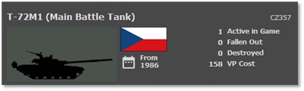
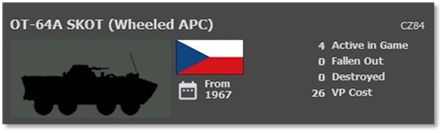
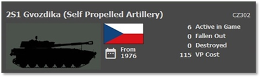
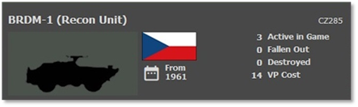
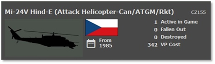
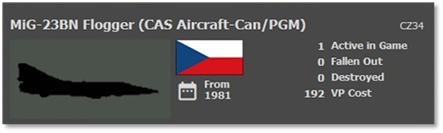

# :smflag-cz: Czechoslovakian Forces

## Overview

One of the key members of the Warsaw Pact is Czechoslovakia. They field a sizeable conscript army equipped with mostly Soviet equipment of slightly inferior capability to the Soviet versions and a few home-designed platforms. The Czechoslovakian army is modeled directly to the Soviet army model. Being in the buffer zone between NATO and the Soviet Union, the Czechoslovakian army was used as a battering ram into NATO at the start of the war to degrade main frontline NATO units so better-equipped Soviet units could pass through and head west.

## Strengths

- Large, conscripted army

- Ground troops have anti-tank capability.

- Some tanks with reactive armor

- Large attack helicopters with ATGMs, rockets, and guns

- Large amounts of artillery mainly towed.

- Large amounts of anti-air assets on the battlefield

- A large number of aircraft for battlefield support

## Weaknesses

- No thermal sights

- Rigid command and control

- Technology is slightly inferior to Soviet systems.

- Few systems are capable of matching frontline NATO units.

## Top Equipment

The following Sections highlight the top weapon platform in each of the categories. The information shown is from the in-game Subunit Inspector.

### Main Battle Tank (MBT)

The T-72M1 is one of the top tanks in the Czechoslovakian army. Smaller than the American M1A1, it has a 125mm main gun, machine guns, and heavy laminate. The T-72M1 has a stabilized gun and decent fire control and range-finding capability but does lack a thermal sight which will hamper it in smoke and darkness compared to many NATO platforms.

The Czechoslovakians have access to a vast number of different tank types.

The T-72 series is the latest. They also have large numbers of T-55s. They can also push many older tanks like the T-54s and T-34/85s into battle.

### Infantry Fighting Vehicle (IFV)

The OT-64A SKOT represents the most common infantry fighting vehicle in the Czechoslovakian Army. It has a turret with machine guns. The OT-64A is lightly armored and carries troops into battle and can also support those troops directly with its weapons if resistance is light. It does not have thermal sights and must rely on optical, night, or IR systems to find enemy targets.

The Czechoslovakian army has several tracked IFVs of the BMP-2 series and the older BMP-1s and OT-62s. All of these are lightly armored. The BMPs have cannons and ATGMs, and the Ot-62s have machine guns for self-defense. Like other Czechoslovakian equipment, no thermals, but some have night vision or IR systems to help see targets at night.

### Artillery

The Czechoslovakian Army operated Soviet self-propelled artillery systems, 203mm 2S7 Pion including the 152mm ShKH vz. 77 Dana. The ShKH vz. 77 Dana was a wheeled self-propelled howitzer with a 152mm gun.

The 122mm D-30 towed howitzer and the 152mm vz. 77/76 towed gun-howitzers were part of the Czechoslovakian artillery inventory.

The Soviet-designed 122mm BM-21 Grad, a multiple rocket launcher system, was part of the Czechoslovakian artillery. The BM-21 could launch rockets over a considerable distance. Other Soviet types of MLRS were the 130mm M-51 as well as the 122mm RM-70.

### Recon Vehicle

The BRDM-1 is one of the most common recon assets used by the Czechoslovakian army to locate enemy units. The BRDM-1 is equipped with a ground search radar (GSR) and night vision for locating the enemy.

It also has a 30mm cannon for counter-recon and self-protection. It lacks a thermal sight. It is lightly armored and not meant to fight toe to toe with enemy units.

The Czechoslovakians have several recon platforms like wheeled jeeps and BRDMs to track BPzVs with a GSR. In most cases, these units have IR for night spotting, and few might have early night vision.

### Attack Helicopter

The Mi-24 Hinds are large, troop-carrying capable attack helicopters capable of wreaking havoc on any undefended armored or mechanized force unfortunate enough to be in their path. Heavily armored for a helicopter, these flying beasts carry weapons like cannons, rockets, and ATGMs of a slightly inferior/older design than their Soviet counterparts. Being large, they are not as agile as most NATO attack helicopters. The Czechoslovakians used these as “flying artillery” platforms to hit enemy positions ahead of assaults and reduce enemy defenses like the Soviets.

The Czechoslovakians have various helicopters, including other models that perform attack, recon, or transport roles. Some helicopters will have night vision allowing night operations, but many will be restricted to daylight operations.

### Close Air Support (CAS)

The MiG-23 Flogger is the Czechoslovakian primary high-end ground attack aircraft. Sporting a 23mm cannon, it also carries many guided and unguided air-to-ground weapons for engaging enemy ground targets. Most have night vision systems allowing for night operation, but they are not rated for all-weather use. This will leave them on the ground if the weather is poor.

The Czechoslovakians have many additional aircraft of all shapes, sizes, and ages.

You can see Mig-29s, MiG-21s, MiG 19s, and MiG-15s over the battlefield along with Su-25s, Su-22s, and Su7s. The Czechoslovakians also have bombers that might be utilized in some cases. Some of these aircraft are night capable, and very few are all-weather capable.