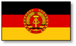
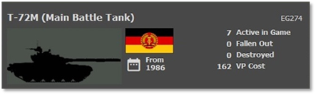
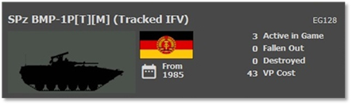
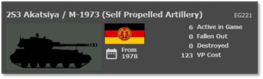
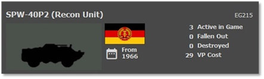
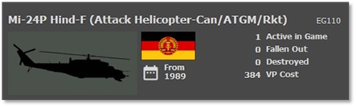
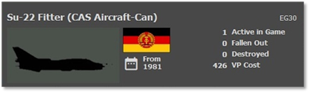

# :smflag-eg: East-German Forces

## Overview

One of the key members of the Warsaw Pact is East Germany. They field a sizeable conscript army equipped with mostly Soviet equipment of slightly inferior capability to the Soviet versions and a few home-designed platforms. The East German army is modeled directly to the Soviet army model. Being in the buffer zone between NATO and the Soviet Union, the East-German army will be used as a battering ram into NATO at the start of the war to degrade main frontline NATO units so better-equipped Soviet units can pass through and head west. One unknown going into battle is how well they will fight against the West Germans, their former fellow citizens.

## Strengths

- Large, conscripted army

- Ground troops have anti-tank capability

- Some tanks with reactive armor

- Large attack helicopters with ATGMs, rockets, and guns

- Large numbers of artillery, mainly towed

- Large amounts of anti-air assets on the battlefield

- A large number of aircraft for battlefield support

## Weaknesses

- No thermal sights

- Rigid command and control

- Technology is slightly inferior to Soviet systems

- Few systems are capable of matching frontline NATO units

## Top Equipment

The following Sections highlight the top weapon platform in each of the categories. The information shown is from the in-game Subunit Inspector.

### Main Battle Tank (MBT)

The T-72M is one of the top tanks in the East German army. Smaller than the American M1A1, it has a 125mm main gun, machine guns, and heavy laminate. The T-72M has a stabilized gun and decent fire control and range-finding capability but does lack a thermal sight which will hamper it in smoke and darkness compared to many NATO platforms.

The East Germans have access to a vast number of different tank types. The T-72 series is the latest. They also have large numbers of T-55s. They can also push many older tanks like the T-54s and T-34/85s into battle.

### Infantry Fighting Vehicle (IFV)

The SPz BMP-1 represents the most common infantry fighting vehicle in the East German Army. It has a turret with a low velocity 73mm cannon and ATGM. The SPz BMP-1 is lightly armored, carries troops into battle, and can also directly support those troops with its weapons. It does not have thermal sights and must rely on optical, night, or IR systems to find enemy targets.

The East German army has a few tracked IFVs of the BMP-2 series and also the older BMP-1s and SPW-50s. All of these are lightly armored. The BMPs have cannons and ATGMs, and the SPWs have machine guns for self-defense.

Like other East German equipment, no thermals, but some have night vision or IR systems to help see targets at night.

### Artillery

The East German artillery included self-propelled howitzers and one of the main types was the 152mm 2S3 Akatsiya / M-1973. The 2S3 was a Soviet-designed self-propelled howitzer that provided mobile artillery support.

Towed artillery pieces were also part of the East German artillery inventory. The 122mm D-30 howitzer, a Soviet-designed towed howitzer, as well as the 120mm 2B11 howitzer.

The Soviet-designed BM-21 Grad, a multiple rocket launcher system, was part of the East German artillery. The BM-21 could launch rockets over a considerable distance. Other Soviet types of MLRS were the BM-24 as well as the RM-70.

### Recon Vehicle

The SPW-40 is one of the most common recon assets used by the East German army to locate enemy units and transport scout teams. The SPW-40 is equipped with IR vision for locating the enemy in the dark. It also has machine guns, counter-recon, and self-protection.

It lacks thermal sight and night vision. It is lightly armored and not meant to fight toe to toe with enemy units.

The East Germans have several recon platforms like wheeled jeeps, motorcycles, and other SPW variants (Soviet BRDMs) to track BRMs with a ground search radar (GSR). In most cases, these units have IR for night spotting, and few might have early night vision.

### Attack Helicopter

The Mi-24 Hinds are large, troop-carrying capable attack helicopters capable of wreaking havoc on any undefended armored or mechanized force unfortunate enough to be in their path.

Heavily armored for a helicopter, these flying beasts carry an array of weapons like cannons, rockets, and ATGMs of a slightly inferior/older design than their Soviet counterparts. Being large, they are not as agile as most NATO attack helicopters. The East Germans used these as “flying artillery” platforms to hit enemy positions ahead of assaults and reduce enemy defenses like the Soviets.

The East Germans have various helicopters, including other models that perform attack, recon, or transport roles. Some helicopters will have night vision allowing night operations, but many will be restricted to daylight operations.

### Close Air Support (CAS)

The Su-22 Fitter is the East-German primary ground attack aircraft. Sporting a 30mm cannon, it also carries many guided and unguided air-to-ground weapons for engaging enemy ground targets. Some have night vision systems allowing for night operation, but they are not rated for all-weather use. This will leave them on the ground if the weather is poor.

The East Germans have many additional aircraft of all shapes, sizes, and ages. You can see Mig-23s, MiG-21s, and MiG-17s over the battlefield. The East Germans also have bombers that might be utilized in some cases.

Some of these aircraft are night capable, and very few are all-weather capable.