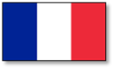
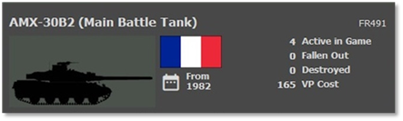
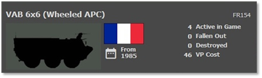
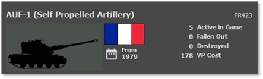
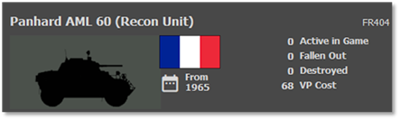
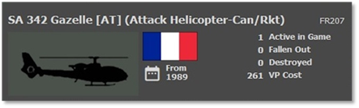
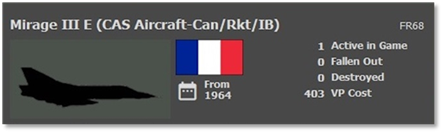

# :smflag-fr: French Forces

## Overview

The French are the only non-NATO member fighting alongside NATO forces in the game. Their force is built around protecting French soil from any aggressor nation. The French army has all French-made equipment in its ranks.

## Strengths

- A very mobile force with many wheeled platforms

- Best suited to fighting in built-up areas like cities

- Several good ATGM weapons

- Good air defense systems

- Infantry has abundant anti-armor capability

## Weaknesses

- Tanks are outclassed by more modern Soviet designs

- Limited platforms with thermal sights

## Top Equipment

The following Sections highlight the top weapon platform in each of the categories. The information shown is from the in-game Subunit Inspector.

### Main Battle Tank (MBT)

The AMX-30 series of tanks is on par with the American M-60 or the West German Leopard 1s. It has medium armor, a 105mm main gun a 20mm gun for anti-air defense, and machine gun(s) for self-protection. The AMX-30 will struggle with the more modern Soviet T-72 and T-80 tanks.

The French have a mix of other tanks, wheeled like the AMX-10 series and tracked like the AMX-13 series of other tanks. These tanks are slightly less capable than the AMX-30s but can have up to a 105mm main gun.

### Infantry Fighting Vehicle (IFV)

The VAB series of armored personnel carriers (APC) are wheeled 6x6 troop carriers with light armor, machine guns, and light cannons for self-defense. They have optical and night vision systems, but most lack thermal sights. They lack their ATGM systems and should not engage enemy forces unless necessary.

The French field is a mix of both wheeled systems like the 4x4 VABs and VCLs and tracked systems like the AMX-VCI and AMX-10P. These are all lightly armored and carry a 20mm cannon and machine guns. Most have night vision.

### Artillery

The French Army operated self-propelled artillery systems, including the AUF1 (Automoteur de 155 mm Modèle F1), which was a 155mm self-propelled howitzer mounted on a tracked chassis. Also, there was the 155mm Cn 155AM Mle 13.

The French Towed artillery included the TRF1 (Towed Rifled 155mm) howitzer. This artillery piece was towed to its firing position and had a 155mm caliber.

The French Army employed multiple rocket launchers, such as the M270 MLRS (M26) (Lance-roquettes multiples), which was a mobile rocket artillery system designed for rapid deployment and firing.

### Recon Vehicle

The Panhard AML 60 is a wheeled recon vehicle. It has light armor, mounts a 60mm breech-loading gun-mortar for its main gun, and has a pair of machine guns for added defense. Being wheeled, it is fast and mobile. It has night vision but lacks thermal sights for dealing with smoke and darkness like many NATO recon vehicles.

The French forces have a mix of additional recon and forward observed vehicles wheeled and tracked. Most are armed with a decent main gun for dealing with enemy recon forces or self-defense against mechanized forces. They should not try to deal with the main battle tanks. A number of these recon vehicles carry a ground search radar (GSR) for spotting the enemy in any conditions.

### Attack Helicopter

The SA 342 Gazelle is one of the leading French attack helicopters.

Fast and agile, these helicopters can be armed with a 20mm cannon, rockets, and HOT ATGMs for dealing with enemy armor. They are equipped with night vision and can fly at night but lack thermal sight.

The French field a wide array of attack and recon helicopters with various capabilities and weapon load-outs. The Gazelle is the newest and most capable of those helicopter platforms. As with other nations, these helicopters need to be aware of the air defense capabilities of the Warsaw Pact forces.

### Close Air Support (CAS)

The Mirage III is one of the top attack aircraft in the French inventory. This aircraft can hit ground targets with an array of both guided and unguided air-to-ground weapons. The Mirage III is both all-weather and night capable. All-weather, which means in cases of bad weather, it can fly missions.

The French have a lengthy listing of aircraft that can hit the enemy over the battlefield. Other fight-bombers in the game are the Super Etendard, Mirage 5s, Mirage F1s, and SEPECAT Jaguars. Before sending an expensive airframe into combat, ensure you have degraded the enemy's air defense assets.