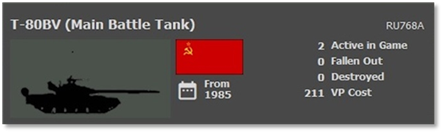
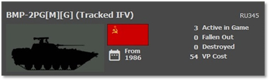
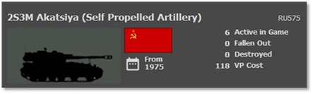
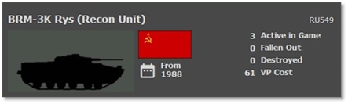
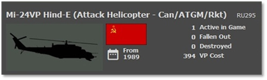
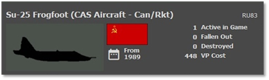

# :smflag-su: Soviet Forces

## Overview

The Soviet Union is the backbone of the Warsaw Pact. Fielding a large, trained conscript army with the most high-tech equipment found behind the Iron Curtain. The Soviets follow with their WW2 doctrine of strength in numbers. They field more equipment than any other nation in the game. Their primary fighting mode is to pour troops at the objectives and steamroll their way through Europe.

## Strengths

- Large, conscripted army

- Ground troops have good anti-tank capability

- Accurate weapon systems

- Well-protected tanks with reactive armor

- Large attack helicopters with ATGMs, rockets, and guns

- Vast numbers of artillery of all types

- Large amounts of anti-air assets on the battlefield

- A large number of aircraft for battlefield support

## Weaknesses

- Very few thermal sights

- Rigid command and control

- Technology is slightly inferior to Western systems

## Top Equipment

The following Sections highlight the top weapon platform in each of the categories. The information shown is from the in-game Subunit Inspector.

### Main Battle Tank (MBT)

The T-80BV is one of the top tanks in the Soviet army. Smaller than the American M1A1, it has a 125mm main gun with the ability to fire an ATGM, increasing the tank's kill potential at the range, machine guns and heavy laminate armor backed up with Explosive Reactive Armor (ERA) designed to defeat HEAT warheads.

The T-80BV has a stabilized gun and decent fire control and range-finding capability but does lack a thermal sight which will hamper it in smoke and darkness compared to many NATO platforms.

The Soviets have access to a vast number of different tank types. The T-80 series is the latest.

They also have large numbers of T-72s and T-64s of frontline caliber. They can also push many second-line tanks like the T-62s and T-55s into battle. A seemingly endless supply of armor.

### Infantry Fighting Vehicle (IFV)

The BMP-2 represents the most common infantry fighting vehicle in the Soviet Army. Like the NATO Bradly or Marder, it has a turret with a 30mm autocannon and an ATGM. The BMP-2 is lightly armored, carries troops into battle, and can also directly support those troops with its weapons. It does not have thermal sights and must rely on optical, night, or IR systems to find enemy targets.

The Soviet army has several tracked IFVs of the BMP-2 series, the older BMP-1s, and some of the new BMP-3s in their inventory. The Soviet motorized forces used the wheeled BTR-80s, 70s, and even 60s series of transports. All of these are lightly armored. The BMPs have cannons and ATGMs, and the BTRs have machine guns or automatic grenade launchers. Like other Soviet equipment, no thermals, but most have night vision or IR systems to help see targets at night.

### Artillery

The Soviet Union had several self-propelled howitzers in its inventory. One prominent example was the 152mm 2S3 Akatsiya, a tracked self-propelled artillery system. Others were 122mm 2S1 Gvozidika, 152mm 2S5 Gialent, and 2S7M Malka.

Towed artillery pieces were an integral part of the Soviet artillery. The 122mm D-30 howitzer and the 152mm D-20 towed howitzer were commonly used.

The Soviets employed multiple rocket launchers, with the BM-21 Grad being one of the most widely used. The Grad system could launch rockets over a significant distance.

### Recon Vehicle

The BRM-3K Rys is one of many tracked and wheeled recon assets used by the Soviet army to locate enemy units. The BRM-3K is equipped with a ground search radar (GSR) and night vision for locating the enemy. It also has a 30mm cannon for counter-recon and self-protection. It lacks a thermal sight. It is lightly armored and not meant to fight toe to toe with enemy units.

The Soviets have many recon platforms, from wheeled jeeps and BRDMs to tracked BRMs variants. Many have a GSR, and a few have early Soviet-designed thermal sights.

### Attack Helicopter

The Mi-24 Hinds are large, troop-carrying capable attack helicopters capable of wreaking havoc on any undefended armored or mechanized force unfortunate enough to be in their path. Heavily armored for a helicopter, these flying beasts carry an array of weapons like cannons, rockets, and ATMs. Being large, they are not as agile as most NATO attack helicopters. The Soviets used these as “flying artillery” platforms to hit enemy positions ahead of assaults to reduce enemy defenses.

The Soviets have a wider variety of helicopters, including other models that perform attack, recon, or transport roles. Most helicopters will have night vision to allow night operations but lack thermal imagers like their NATO counterparts.

### Close Air Support (CAS)

The Su-25 Frogfoot is the Soviet analog to the American A-10. This is a purpose-built ground attack aircraft with heavy armor protection, a 30mm cannon, and the ability to carry many guided and unguided air-to-ground weapons.

The Soviets have many additional aircraft of all shapes, sizes, and ages. You can see MiG-29s, Su-27s, MiG 27s, and Su-24s down to Su-7s and Mig-21s. The Soviets also had many larger bombers that might be utilized in some cases. Many aircraft are night capable, while others are even all-weather capable.