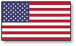
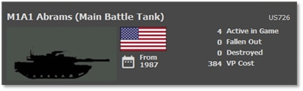
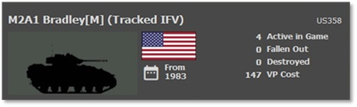
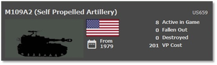
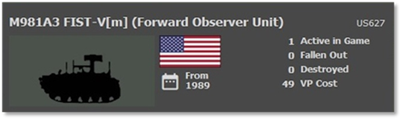
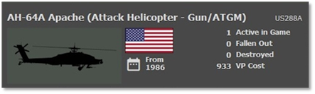
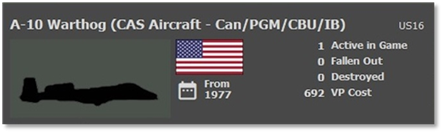

# :smflag-us: American Forces

## Overview

One of the cornerstones of the NATO alliance is the Americans. They are fielding a well-trained volunteer army with the most high-tech equipment on the battlefield. Like most NATO countries, quality has a quantity of its own, and the Americans bring many of the most expensive high-tech platforms to the fight.

## Strengths

- Well trained forces

- Ground troops have good anti-tank capability

- Thermal Sights that see through smoke and darkness

- Highly accurate weapon systems

- Well-protected tanks

- Deadly attack helicopters with long-ranged ATGMs

- A good amount of air support and artillery

## Weaknesses

- Limited local air defense capability

- Expensive equipment

- Second-tier platforms are inferior to Soviet platforms

- Limited numbers compared to the enemy

## Top Equipment

The following Sections highlight the top weapon platform in each of the categories. The information shown is from the in-game Subunit Inspector.

### Main Battle Tank (MBT)

The top tank for the Americans is the M1A1 Abrams. The M1A1 is fast and heavily armed with a 120mm cannon and many machine guns. It is well protected with advanced composite armor providing extra resistance to HEAT warheads. This main battle tank has excellent fire control systems, top-of-the-line thermal sights, and optical systems to allow it to hit moving targets kilometers away.

Some second-line units will use the older M-60 series of tanks. These tanks have a less powerful 105mm gun and weaker armor. They may also lack thermal sights and top-end fire control systems.

### Infantry Fighting Vehicle (IFV)

The M2A1 Bradley is the top US IFV. It carries troops into battle and can support them with its 25mm cannon and dual TOW missile launcher. It has light armor to protect the squad or teams carried inside. The M2A1 can engage enemy tanks with the TOW ATGMs, but it should not try to go toe-to-toe with them. The 25mm cannon can take out light enemy vehicles such as Recon, APCs, and IFVs.

The Americans also use the M113 series of Armored Personnel Carriers (APCs) in second-line units. The M113 may have a machine gun for self-defense, but it is not meant to fight or support the troops it carries.

### Artillery

The M109A2 is a part of the M109 family of self-propelled howitzers, which has been a staple in the artillery units of the U.S. Army and many other military forces worldwide.

It is typically equipped with a 155mm M185 cannon, capable of firing various projectiles, including high-explosive shells and other specialized rounds.

The Americans also have the 203mm M110A2, 105mm M108, and the 175mm M107 in their inventory.

There is also towed artillery, which is the 105mm M119,   155mm M198, 105mm M101, and the 155mm M114.

The M270 Multiple Launch Rocket System (MLRS) was in service during this period. The M270 could launch a variety of rockets, including the Army Tactical Missile System (ATACMS), providing long-range precision firepower.

### Recon Vehicle

One of the best Recon vehicles in the American arsenal is the M981A1 FIST-V forward observation vehicle. This vehicle is lightly armed and armored but has a raisable mast with a suite of thermal and optical sensors for stopping enemy units and then calling in artillery or airstrikes on those targets.

The Americans also have numerous vehicles that carry recon teams. This includes M3 series Bradley scout vehicles, M113s, and jeeps.

### Attack Helicopter

The AH-64A Apache is the best attack helicopter in the game. Fast and deadly, it is armed with a 30mm chain gun, rockets, or laser-guided Hellfire ATGMs that can kill any enemy tank out to 8km. It has some armor to deal with small arms fire, but it needs to steer clear of advanced enemy air defense assets. A pair of these helicopters can take down a battalion of enemy armor in minutes.

The American forces also have the AH-1 Cobra armed with TOW ATGMs, rockets, and guns. For scouting, there is the OH-58D Kiowa. This helicopter has a sensor suite in a mast mount, allowing it to hide behind cover and look for enemies day or night.

### Close Air Support (CAS)

The A-10 Warthog is a purpose-built ground attack aircraft centered on the GAU-8 multi-barrel 30mm cannon and the ability to carry a heavy load of air-to-ground weapons to smash enemy armored forces. Designed for the fight at the front, the A-10 can take punishment and fly on one engine if needed.

The Americans have a lengthy listing of aircraft that can hit the enemy over the battlefield. Other fast-movers in the game are the F-15 Eagle, F-16 Falcon, and F-4 Phantoms. Also, on the high-tech end of the spectrum, the F-117 Nighthawk stealth fighter can fly across the sky unopposed.