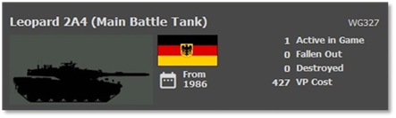
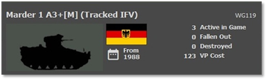
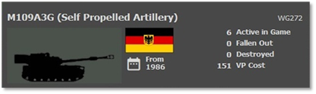
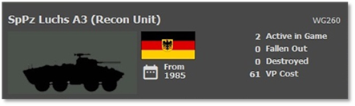
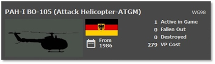
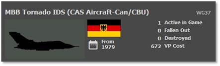

# :smflag-de: West-German Forces

## Overview

The West Germans are another of the key NATO members, and they are right on the frontlines of WW3 and need to defend their homeland. The Bundeswehr fields a well-trained army with high-tech equipment of its designs. Like most other primary NATO nations, the West Germans rely on having quality equipment and training over numbers.

## Strengths

- Well trained forces

- Ground troops have good anti-tank capability

- Thermal Sights that see through smoke and darkness

- Highly accurate weapon systems

- Well-protected tanks

- Attack helicopters with hard-hitting ATGMs

- A good amount of air support and artillery

- Excellent air defense systems

## Weaknesses

- Expensive equipment

- Second-tier platforms are inferior to Soviet platforms

- Limited numbers compared to the enemy

## Top Equipment

The following Sections highlight the top weapon platform in each of the categories. The information shown is from the in-game Subunit Inspector.

### Main Battle Tank (MBT)

The Leopard 2A4 is a top-of-the-line main battle tank on par, if not better, in some cases than the American M1A1. It has heavy composite armor, excellent protection from HEAT warheads, and a 120mm main gun. The same gun the Americans use on the M1A1s.  Fast and maneuverable with thermal sights and good fire control and range finding.

The West Germans also have several earlier series Leopard 2 tanks and a good number of second-line Leopard 1s.

The Leopard 1s are outclassed by the later models of Soviet tanks and more likely to be lost to enemy anti-tank weapons.

### Infantry Fighting Vehicle (IFV)

The Marder 1 series of infantry fighting vehicles is the West-German answer to the American Bradley and Soviet BMP types of troop carriers. It has light armor for small arms protection. It carries a 20mm autocannon and machine guns for self-defense, and some variants also carry the Milan anti-tank missile for dealing with enemy tanks.

The West Germans also have several M113s and TPz Fuchs vehicles to move troops across the battlefield. These vehicles vary in capability to defend themselves but are all lightly armored.

### Artillery

The West German artillery units were equipped with various types of artillery pieces, including self-propelled howitzers and towed artillery, designed to provide indirect fire support to ground forces. The West Germans updated the existing M109G to a new version M109A3G with a new 39 caliber barrel based on the FH-70 towed howitzer.

The installation of the new 39 caliber barrel allows the full family of improved 155 mm ammunition to be fired.

Other West German SP howitzers are the 175mm  M107 and the 203mm M110A2.

West Germany also has towed artillery, 155mm FH70, and the 105mm M119.

In addition to larger artillery systems, the West Germans had various mortars in their inventory. Mortars are smaller, portable artillery pieces used for shorter-range indirect fire. Which includes 60mm, 81mm, and 120mm mortars.

While MLRS is primarily a rocket artillery system, it was part of the artillery capabilities of the West German Bundeswehr which are LARS and MLRS. MLRS can launch a variety of rockets with different warheads.

### Recon Vehicle

The SpPz Luchs series of armed recon vehicles are wheeled, lightly armored recon platforms with thermal and optical sensors. The Luchs also mount a 20mm autocannon and machine gun for dealing with enemy recon and other lightly armored vehicles. Being a wheeled 8x8 platform, it has good mobility and cross-country speed.

The West Germans also have several other ground recon vehicles.

This includes jeeps, M113s, and recon versions of the Fuchs, including one with a ground search radar (GSR).

### Attack Helicopter

The PAH-I BO-105 attack helicopter is a light attack helicopter that carries the HOT series of anti-tank guided missiles (ATGMs). Smaller than other attacked helicopters like the Soviet Hind or American AH-64 Apache, it is a smaller and nimbler platform. It does not carry a gun and should only look to commit standoff attacks at range with the ATGMs. It is equipped with a thermal sighting system making it capable of finding enemy targets through smoke or darkness.

The West Germans also have a recon version of the BO-105 and use French-made Alouette II. Both platforms have night vision and optical spotting systems but lack thermal images.

### Close Air Support (CAS)

The MBB Tornado is a top-of-the-line multi-role fighter of West German, Italian, and British design. This swing-wing aircraft was designed for low-level penetration into hostile environments where it could drop an array of guided and unguided air-to-ground weapons. This included nuclear weapons if needed. The Tornado is night mission capable, and some versions have the all-weather capability. The Tornado also has defensive systems for warning and defeating threats.

The West Germans have an array of other aircraft for the strike, SEAD, and recon missions. This includes Alpha Jets,

F-4 Phantoms, and F-104s to engage enemy ground and air defense targets.
