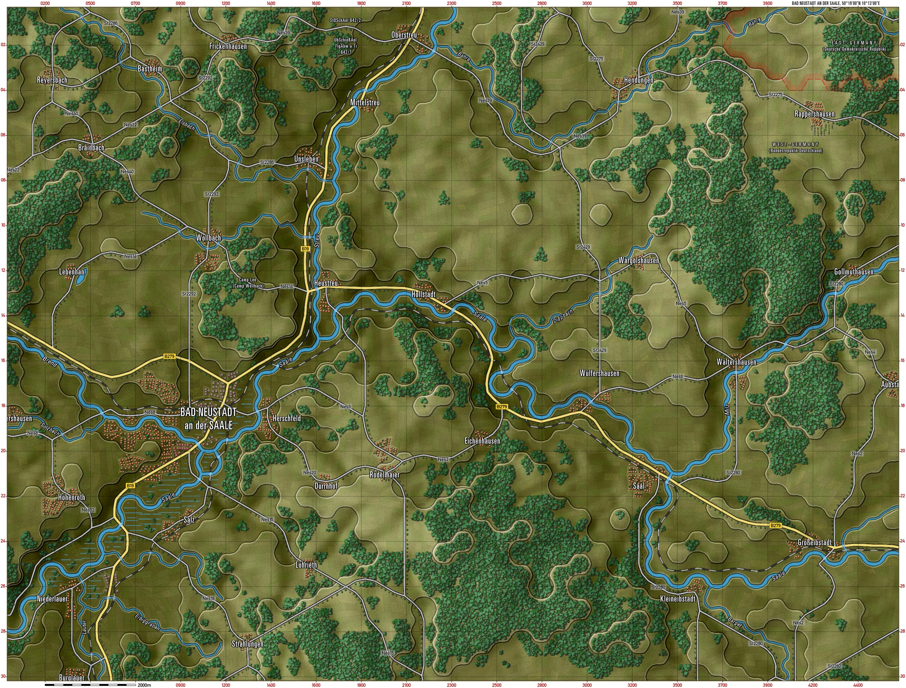

# Bad Neustadt

=== "Briefing Map"

<<<<<<< HEAD
     }})

=== "Gameplay Map"

     }})
=======
    

=== "Gameplay Map"

    
>>>>>>> f38cecd (Many changes to folder structure, new maps, scenarios, etc.)
