# Creating Battle Plans

A couple of things to remember, BPs are not required. Forces do not have to have Battle Plan Missions. If the unit does not have a mission, the AI will move the units as it sees fit. A single Battle Plan can be units or forces moving to different locations with no assigned mission. A Battle plan can contain some units/forces with missions and some without. You can use them to set up the units on the map or add BP missions to move units into a particular location and then let the AI take over or have detailed missions.

Also, each mission has a time limit (set by the program – the human designer has no control). Once the time limit is reached, the mission is canceled, and it advances to the next mission, or the AI takes over.

If the mission is too long and involved, it may not be completed before the time limit is reached. It is better to set smaller missions chained together. There is no limit to how many missions there can be.

So, after creating your forces and you place them on the map. Select the Battle Planning tab as shown in Fig. 3.

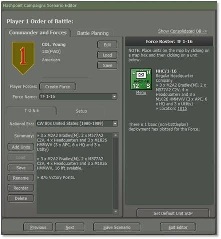

Fig. 3

A screen will show the Battle Planning highlighted as shown in Fig. 4.

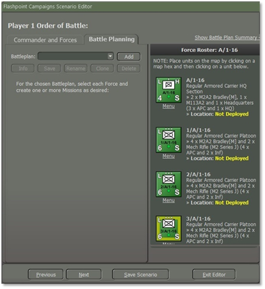

Fig. 4

You noticed that even though you placed the forces on the map during the “Creating Forces” it shows that the unit is not deployed as shown in Fig. 4. To add a mission, select the “**Add**” button as shown in Fig. 4.

As shown in Fig. 5, You need to enter a name for the Battle Plan. You should name it “BP US 1”, “BP1 US”, or “US BP1”.

You want to give a number to the BP and the Nationality indicator for which we will use “US” for the United States as shown in Fig. 5.

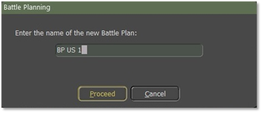

Fig. 5

This part is crucial if you do this wrong. If you select the “**Yes**” button, the units that you deployed on the map will be placed back as “Not Deployed”, and you will have to redo deploying the forces back onto the map. If you select the “**No**” button, the units you have placed on the map will remain where you deployed them.

We will select the “**No**” button as shown in Fig. 6.

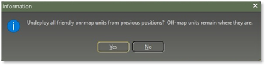

Fig. 6

Before we begin to build a Battle plan for the first Task Force let's look at Fig. 7, there are five (5) buttons,

1. **Info:** This shows the Info screen. 2. **Save:** Fig. 8 shows the location of the save file for BP US 1 which will be in the folder of the scenario. Each save BP will be added to the folder of the scenario. It is best that anytime you add/make changes to the BP save as often as possible.

1. **Rename:** To rename the new Battle Plan. 2. **Clone:** When selected, a popup screen to enter a new name to the new plan duplicates a current battle plan to a new one.

1. **Delete:** Selecting this button will delete the current Battle Plan.

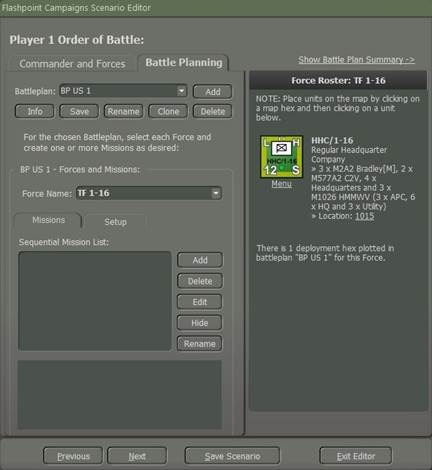

Fig. 7

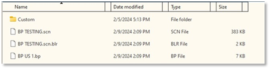

Fig. 8

Battle plans are created in the Scenario Editor. Multiple alternative battle plans may be created per side per scenario, but only one will be in effect for the game. The player will be allowed to choose which one is in effect for the computer player, and if desired, may use a randomly selected one to vary play.

## Movement

We open the “Battle Planning” tab to select a task force and set up missions. We will select A/1-16 and by using the “**Ctrl**” key and right-click on it, it will select all the subordinates in the company. Select the “**Add**” button as shown in Fig. 9. When you select the “**Add**” button a popup screen as shown in Fig. 9 will appear. We will type in the name box “Mission 01” and then select the “**Proceed**” button.

**NOTE:** Each “Mission Name” for a force must be unique.

**NOTE:** When you create one or more Missions for each task force. You must create them in chronological order, as the ending point of one will become the starting point of another.

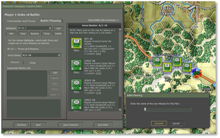

Fig. 9

Once you select the “**Proceed**” button a mission icon will appear on the A/1-16 unit as shown in Fig. 10.

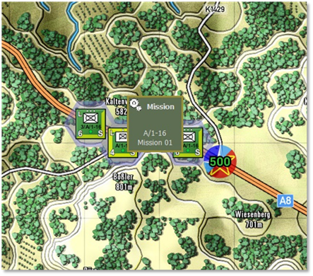

Fig. 10

When the Mission icon appears on the unit, simply right-click it to reveal a menu of permissible mission directives. These directives closely resemble the unit orders with identical objectives that can be assigned to them as shown in Fig. 11.

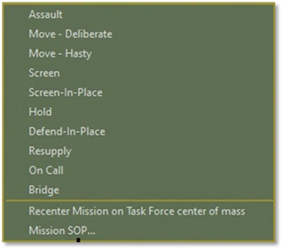

Fig. 11

We’re going to give it the mission “Move-Deliberate” on, and off the road but defensively as shown in Fig. 12.

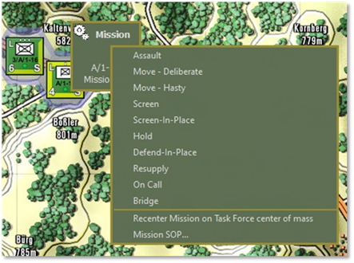

Fig. 12

When you select “Move-Deliberate” a screen will pop up as shown in Fig. 13. You can use just one waypoint or up to three waypoints. Because it is an IFV company we will use all three of them and select the “**Commit**” button as shown in Fig. 13 after placing the waypoints.

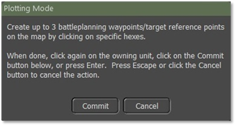

Fig. 13

As shown in Fig. 14 we placed three waypoints. You can also move a waypoint to a different location on the map, to move the route as shown in Fig. 15.

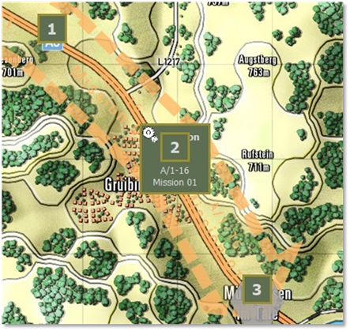

Fig. 14

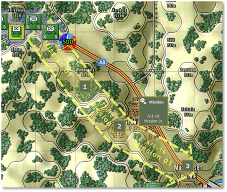

Fig. 15

For the next mission, select the “**Add**” button we’re going to label this mission as “Screen 01” then select the “**Proceed**” button. A new mission icon will pop up over the end part of the first mission as shown in Fig. 16. We’re going to select the “Screen-in Place”. Select the “**Edit**” button and a screen will pop up as shown in Fig. 17.

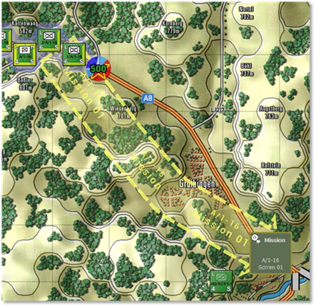

Fig. 16

As illustrated in Fig. 17, “A/1-16 Mission Parameters”. Screen-in-Place Orders Staff estimate the time from 07:00 to 15:00 approximately.

**NOTE:** Make the changes to the Mission SOP, Duration, and Frontage first before selecting the “**Proceed**” button.

1. Mission SOP, as shown in Fig. 17 2. Duration, how long is the time for Screening in Place? For this mission, it will be 60 minutes as shown in Fig. 18

1. Frontage, the default frontage (m) is 500m. You can set it to whatever you want it to be as shown in Fig. 19, you can adjust the size of the frontage, and the symbol for the screen will get large or small.

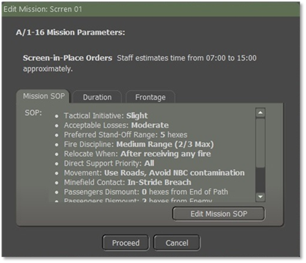

Fig. 17

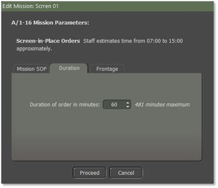

Fig. 18

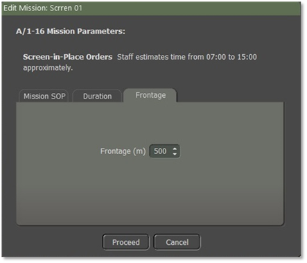

Fig. 19

The last mission to add is “Resupply” as shown in Fig. 20.

To edit and/or look for it on the map for the mission that is listed in the “Sequential Mission List”. Just highlight it and it will show on the map.

To delete a mission just highlight it and select the “**Delete**” button as shown in Fig. 20. But you can only delete the last mission. This example is “Resupply 01” and the “**Delete**” button will be active and not grayed out. You cannot delete the mission before it. You must delete sequential from the last to the next to last and so on.

To hide a mission on the map, just select the “**Hide**” button and all the routes and missions will be removed from the map.

When you want them back on the map, just select the “Show” button that has replaced the “**Hide**” button.

Select the “**Rename**” button if you need to change the name of the mission to a popup screen as shown in Fig. 21 to rename the mission.

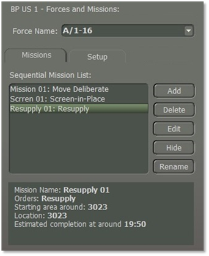

Fig. 20

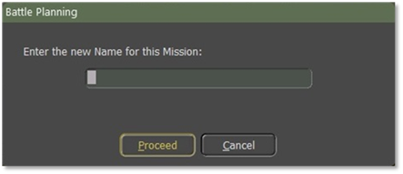

Fig. 21

## Artillery

After finishing the Mission for A/1-16 we will select another task force and set up missions for it. We will select 2-5 FA and by using the “**Ctrl**” key and right-click on it, it will select all the subordinates in the Artillery battalion. Select the “**Add**” button as shown in Fig. 9. When you select the “**Add**” button a popup screen as shown in Fig. 9 will appear. We will type in the name box “Mission 01” and then select the “**Proceed**” button.

**NOTE:** Each “Mission Name” for a force must be unique.

**NOTE:** When you create one or more missions for each task force. You must create them in chronological order, as the ending point of one will become the starting point of another.

**NOTE:** Order/Delay between artillery missions. For the US, it's 5 minutes. Add another minute for issuing the order and it’s 6 minutes between rounds landing from hex to hex for a firing unit.

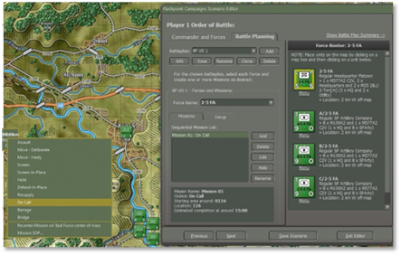

Fig. 22

Right-click on the mission icon and then select “On Call” as the first mission.

Select the “**Edit**” button as shown in Fig. 22, to make changes to the “Mission SOP” and to adjust the “Duration” of this mission “On Call”.

Because it is an “On Call” mission we are going to use “Shoot and Scoot” Go to the “SOP” tab and select “Artillery/Scoot and Shoot”. Another screen will be displayed as shown in Fig. 23.

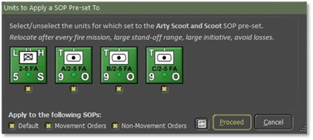

Fig. 23

Fig. 23, shows that all the units in 2-5 FA will all get the same SOP for Scoot and Shoot” for an “On Call” mission. If I don’t want B/2-5 FA to have the same “SOP”, I need to uncheck the “**x**” under the unit icon first before selecting the “**Proceed**” button as shown in Fig. 23.

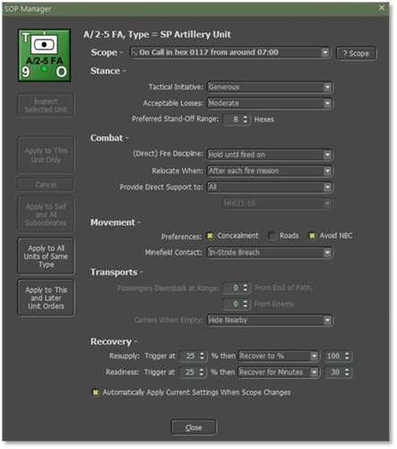

Fig. 24

The Presets for the Scoot and Shoot shown in Fig. 23, will update the SOP Manager as illustrated in Fig. 24. You can also make changes by using the Adjust SOP.

We’re going to create another mission; this one will be a “March” mission.

Let’s select the “**Add**” button and then select “Move-Deliberate” as shown in Fig. 25.

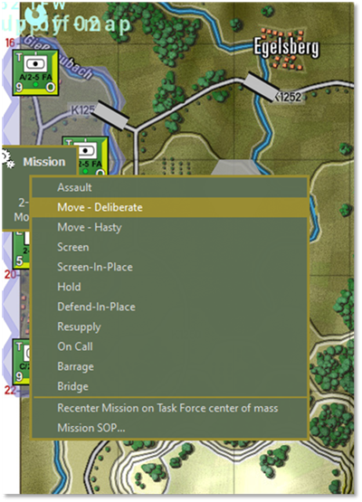

Fig. 25

You will then get a screen as shown in Fig. 1. As shown in Fig. 27 we placed three waypoints. You can also move a waypoint, to move the route and then select the “**Commit**” button.

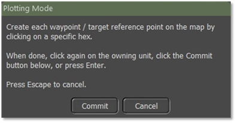

Fig. 26

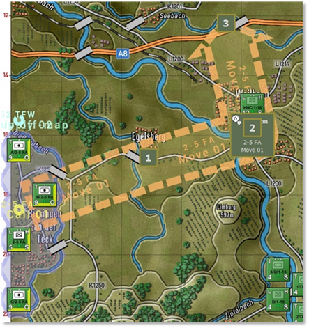

Fig. 27

Inside the graphics are the unit's name and the mission label as you can see in Fig. 27.

The third mission will be a “Barrage” Select the “**Add**” button and then select “Barrage” as shown in Fig. 28.

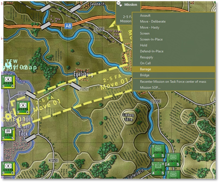

Fig. 28

When you select “Barrage” a screen will pop up as shown in Fig. 29. You can use just one waypoint or up to three waypoints. Because it is an Artillery Battalion with three batteries, we will use all three and select the “**Commit**” button as shown in Fig. 29 after you mark the waypoints for the barrage.

When assigning barrages to a BP, you are allowed to set 3 waypoints. Each waypoint is assigned to a battery in the force. So, you can only assign a WP to each of the 3 batteries in a barrage mission. If you have 4 batteries in a force, the 4th one will not be assigned a WP. The WPs are assigned based on their position in the formation.

The first battery will fire at the 1st WP and so on. When you set a Barrage Mission, all three batteries (if there are 3 batteries) will fire if they have the ammo for that Barrage Mission.

 To fire different types of ammo, you must have a barrage mission for each type of ammo. For example, one battery has HE and smoke, another has HE and non-persistent chem, and the third has HE and persistent chem rounds (in reality, they all three had smoke rounds, but for this example, I'm pretending that only one had it).

I fired first a smoke mission and set the three WP. I placed the WP for the battery with the smoke where I wanted the smoke to go. The other two did not fire so it did not matter where their WPs were. The second barrage was for non-persistent chem. I again placed my three waypoints with the one for the battery with non-persistent chem where I wanted the NP chem to land. I did the same for the third barrage for persistent chem.

**NOTE:** As for Nukes, during the time of writing this FM Battle Planner, Nukes is a problem for the Developers. Hopefully, soon it will be working as planned.

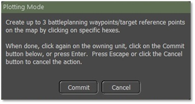

Fig. 29

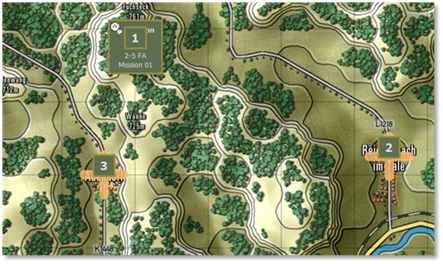

Fig. 30

Fig. 30 shows all three barrage waypoint markers on the map.

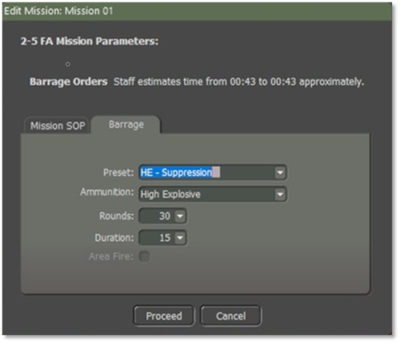

Fig. 31

Once you place the three waypoint Barrages on the map select the “**Edit**” button. A screen will pop up as shown in Fig. 31. Mission SOP should have been checked to make sure that is the SOP that you want for this mission.

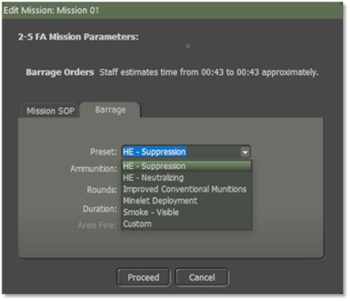

Fig. 32

Select the “Barrage” tab as shown in Fig. 1. Fig. 32 shows all the types of a Pre-set fire mission.     - HE-Suppression     - HE-Neutralizing     - Improved Conventional Munitions     - Minelet Deployment     - Smoke-Visible     - Custom 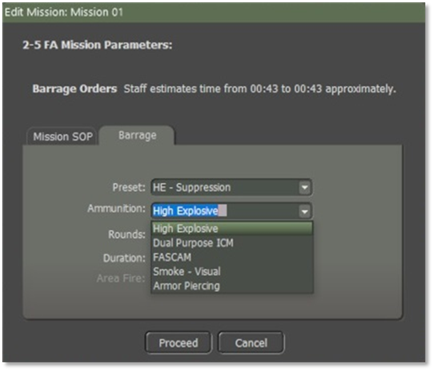

Fig. 33

Use the drop-down for all the ammunition types as shown in Fig. 33.

Fig. 31 shows “Rounds” and Duration”. The default for Rounds and Duration are 30 for rounds and 15 for the duration. When you make changes to either rounds and/or duration the preset switches to “Custom” when you select the “**Proceed”** button.

**NOTE:** “Area Fire” is for things like rocket barrages which can target multiple hexes. It will highlight when using Rocket units.

## Engineering

Engineering units are used to do specific tasks such as laying a bridge over a stream or river, clearing mines and obstacles, and blowing bridges to deny their use by the enemy.

So, for the first example, we are going to get an engineer bridge layer as its force to lay a bridge by using Battle Plans.

The second example will be an engineer bridge Layer attached to a Tank Company.

An engineer unit can be its own Force, or it can be part of a Maneuver Force.

We will move the engineer bridge layer up near the river to be bridged using “Move to Hasty” as shown in Fig. 34.

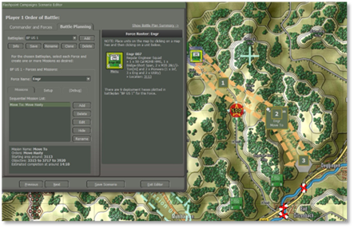

Fig. 34

You then “Add” a new mission for the Force and select “Bridge” from the orders as shown in Fig. 35.

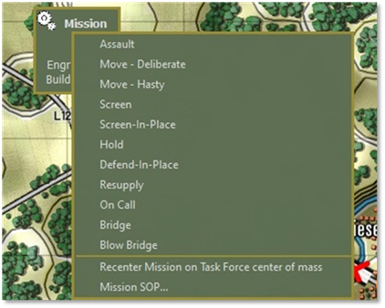

Fig. 35

Next place the three waypoints along the river where the engineering unit will lay a bridge as shown in Fig. 36.

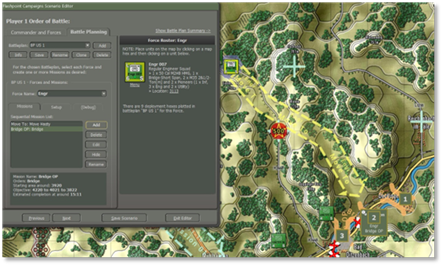

Fig. 36

The AI will select one of the three waypoints as the bridging location.

To set my engineer unit SOP, I select from the “Set SOP” and select “Engineer under Fire” as shown in Fig. 37.

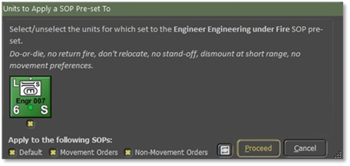

Fig. 37

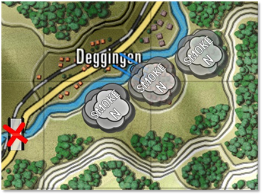

Fig. 38

With the units hidden, you can see the smoke screen as well as the bridge starting to be laid by the engineers at the first waypoint. It moved to the third waypoint and then to the second one before deciding to select the first waypoint as shown in Fig. 38.

The Artillery began to fire smoke in front of the engineer unit with the engineer unit being the spotter as shown in Fig. 39.

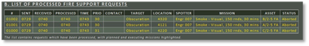

Fig. 39

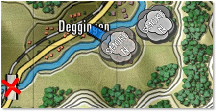

Fig. 40

Fig. 40 shows the bridge laid.

The computer player will decide to bridge solely in two situations:

1. if there is no alternative way to cross a    water obstacle (and it has bridging available) 1. if explicitly told to create bridges by a    Battleplan bridging mission. You need to mark the far side of the    crossing. You can place multiple crossing locations. The computer player    may attempt multiple simultaneous crossings (which is wise when the    crossing is opposed) if the task force has multiple bridge layers, preferably    in separate groups.

The computer player can identify alternative crossings, perhaps 5km away, and decide not to bridge.

(Since we don't have "sector boundaries" the computer player won't understand that alternative crossings are not viable. Since bridges are scarce, the computer player cannot use the Red Storm mechanism of constructing a bridge every time it runs into a water obstacle).

The second example will be C 1-16 INF (Armor) with an engineer bridge short span attached to the company.

I want to change the “Order of March’ in the company by selecting the “Reorder” and moving the Engineer unit and placing it behind the 1/C/1-16 and then followed by the 2/C/1-16 and 3/C/1-16.

After attaching an Engineer Bridging Unit to C/1-6 (Armor), hold the “Ctrl” key down and left-click on the Tank Company HQ, and all the units within the company are selected as shown in Fig. 41.

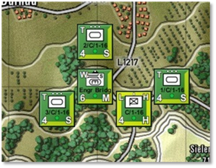

Fig. 41

The reason for doing that is I want to use large selections for the Set SOP and Adjust SOP mechanisms which have been designed to work with large selections of units. Even when you want to apply different changes to the HQ and line units of a group. It is quicker to select the whole group, apply changes to the whole group and confirm, then apply another SOP preset to the line units, exclude the HQ, and confirm. Finally, by selecting an SOP preset for the HQ, invert the selection including the HQ, and confirm. That way, you end up with the whole group still being selected, and ready to accept a group move order.

Another thing to remember is how to use the “Movement Orders” and the “Non-Movement Orders” as shown in Fig. 42.

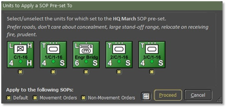

Fig. 42

If you want your units to behave differently “On the Move” compared to when they arrived and were in place. For example, to have your tank units quickly move into their screen and fight positions, you want them to use the roads. But once screening, you want them to fall back via locations and paths offering concealment.

To do so, select the tank units and adjust the SOP to prefer road movement for all SOPs (all checked as shown in Fig. 42).

Next issue the movements to the screening positions. Finally, select the tank units, adjust the SOP to not care about road movements, prefer concealed movement, and apply the changes only to the Defaults SOP and Non-Movement Orders, so you need to uncheck the Movement Orders.

For a quick inspection of specific actual Sop settings in your selection. For example, to check which units are set to “Maximum Range”, select the relevant units, then use the Adjust SOP and choose any Fire Discipline. The resulting confirmation dialog will show you the current fire discipline setting for each selected unit as shown in Fig. 43.

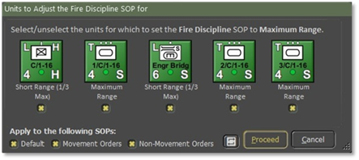

Fig. 43

Now, we will click on the “**Add**” button to add a mission.

Add “Mission Advance:” Move Hasty, then “Bridge Ops: Bridge, and then Advance 01: Move Deliberate as shown in Fig. 44, 45, and 46.

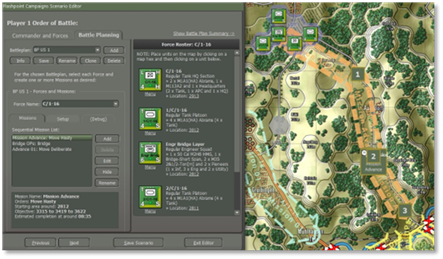

Fig. 44

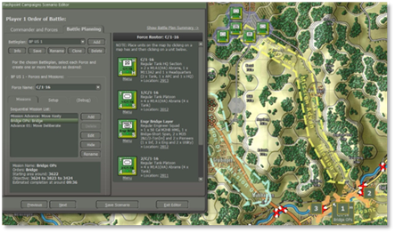

Fig. 45

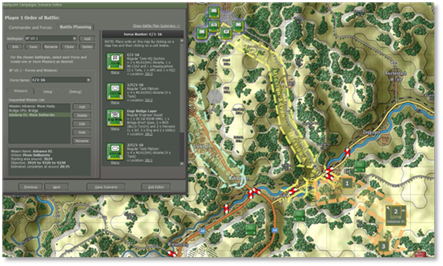

Fig. 46

Once I have set up my missions, I need to save it by selecting the “**Save**” button.

Looking at Fig. 47 you can see that artillery is firing smoke rounds to cancel the engineers laying a bridge, while 3/C/1-6 is providing support to the engineers, while the rest of the company is in a hold position until the bridge is laid.

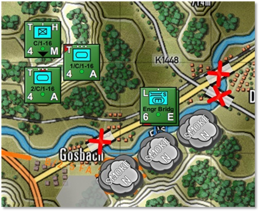

Fig. 47

Fig. 48 shows the 3/C/1-16 unit has crossed over the bridge, and the rest of the company is moving to cross over the river to continue with the mission. Unfortunately, the engineer bridge layer will not recover the bridge to continue with the C/1-16 mission. Just add more bridge layers to the task force. That feels safer and is more robust than removing the bridge from the obstacle you just crossed, disconnecting you from supply and reinforcements (and perhaps stragglers from your formation still on the wrong side of the obstacle).

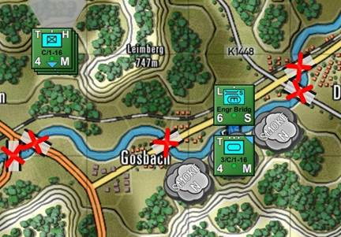

Fig. 48

One thing to remember is because we don't have "sector boundaries" the computer player won't understand that alternative crossings are not viable. That is why I had to destroy bridges so that the unit would have to hold in a position until the bridge was laid as shown in Fig. 47. If the bridges weren’t blown the units would cross over the other bridges and ignore the Engineer unit.

## Helicopters

Feature to be added in a future expansion.