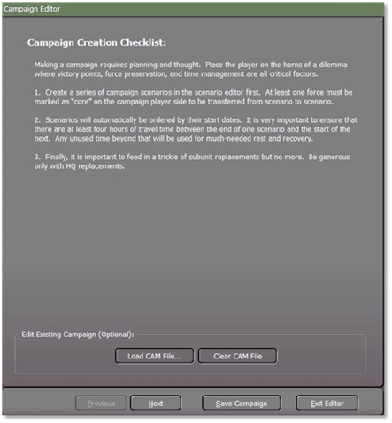
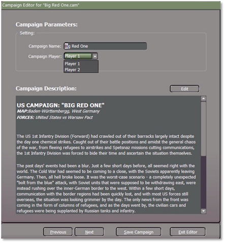
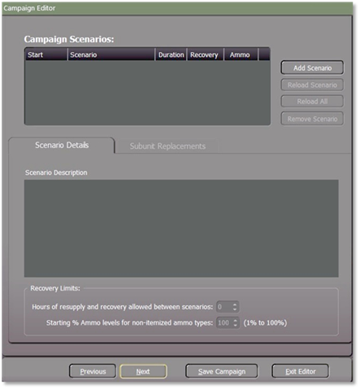
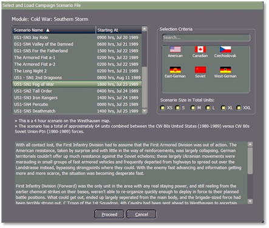
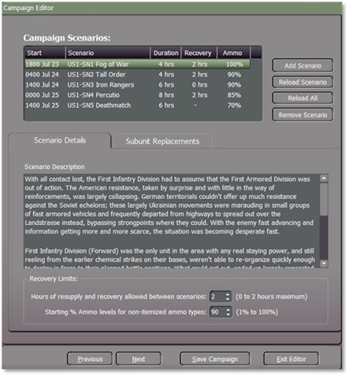
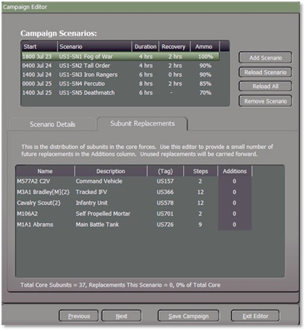
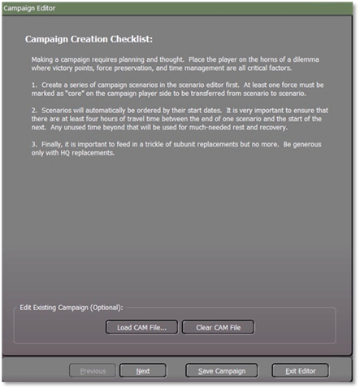
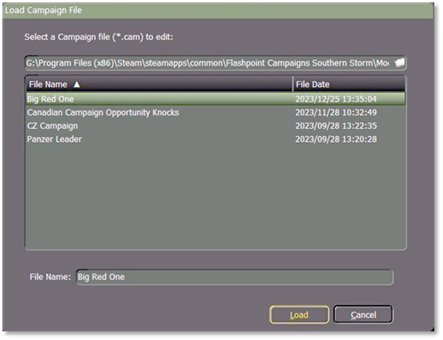
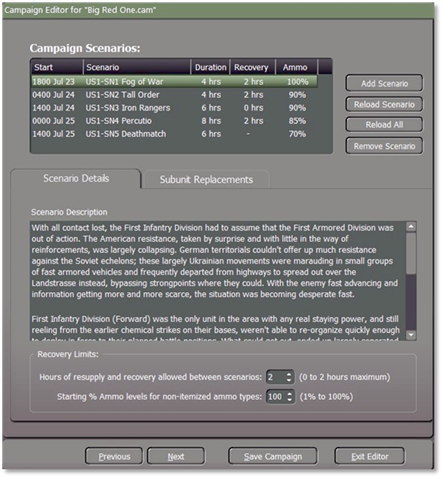
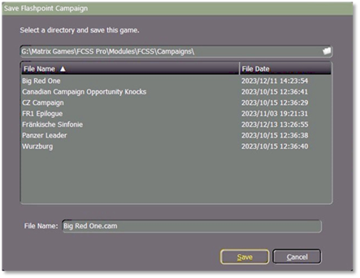

# Campaign Editor

This section will guide you through the process of creating a campaign, with the final step covering how to edit an existing campaign.

## Create a Campaign

Because we’re going to put all the standalone scenarios into a campaign, we will have to select the “**Next**” button, which will take you to the Campaign Parameters window.

**1.** Provide a title for the campaign.

**2.** Choose the campaign player by selecting either player 1 or player 2. The campaign can only be experienced from one side. For this example, it will be Player 1.

**3.** In this section, you'll provide a campaign description that sets the tone and provides essential information for players engaging in the campaign.

Once you have finished the campaign parameters, select the “**Next**” button which will take you to the Campaign Scenarios selection window.

Now we’re going to select the standalone scenarios for the campaign. To do that we have to select the “**Add Scenario**” button and a “**Select and Load**” window will pop up. As shown below.

Here we will highlight and select the “**US1 – SN1 Fog of War**” scenario as the first scenario and then select “**Proceed**” which will return you to the Campaign Scenarios to load the next scenario until you have all the scenarios loaded.

**NOTE:** Scenarios will automatically be ordered by their start dates.

It is essential to ensure that there are at least four (4) hours of travel time between the end of one scenario and the start of the next.

The times between scenarios are critical to the core force recovery. Don’t make them too long or too short.

Any unused time beyond that will be used for much-needed rest and recovery.

Refer to **FM FCCW** **– 04/R1 Scenario Design Chapter 4.1.1 Setting, Creating a New Scenario** guideas your reference**.**

 

Recovery Limits,

**1.** Allowable duration for resupply and recovery between scenarios (ranging from 0 to a maximum of 2 hours).

**2.** Initial percentage levels of ammunition for non-itemized ammo types (ranging from 1% to 100%).

Once you have selected the hours of resupply and the ammo levels select the “**Subunit Replacements**” tab

The incorporation of “**Additions**” replacement equipment should be kept to a minimum. The availability of spare units in inventory during peacetime is limited, implying that the additions primarily involve equipment cannibalized from disbanded units elsewhere.

If the inclusion of replacements is necessary, it is advisable to prioritize Headquarters subunit replacements generously.

This ensures the flexibility to reconstitute various headquarters as required between scenarios.

## Edit a Campaign

To modify an existing campaign, click on the "**Load CAM File**" button.

Highlight the “Campaign Scenario” name for this example “Big Red One” and then select the “**Load**” button.

If you need to make a change or to update the Campaign Description select the “**Edit**” button. If you do not need to make any changes to the Campaign parameters or Campaign Description, then select the “**Next**” button.

If you've created an additional scenario to add to this campaign, click the "**Add Scenario**" button.

In case you need to replace a scenario after making any adjustments, highlight the specific scenario and then choose the "**Reload Scenario**" button to reload only the selected scenario.

If you've made any adjustments to multiple scenarios and need to update them all at once, opt for the "**Reload All**" button, which will reload all scenarios simultaneously.

If you need to remove a scenario that you don’t want in the Campaign highlight it and then use the “**Remove Scenario**” button.

When you’re finished, then select the “**Save Campaign**” button which will cause the Save Flashpoint Campaign window to pop up.

When you select the “**Save**” button the CAM file will be updated.