# Creating a Campaign Scenario

In this section, we will cover how to create a Core Force and the naming of the Campaign scenarios.

When developing a campaign scenario, you should aim to create a series of two (2) to five (5) scenarios using the **FM04 Scenario Design** guideas your reference for making each scenario**.**

## Creating a Core Force

These are the forces that will be carried forward from scenario to scenario as the campaign progresses. Everything not designated as a core force will be an ‘attachment’ that has a lifespan restricted to one scenario. Typically, the various maneuver forces for the side in question will be designated core, and the supporting air, helo, and artillery (on and off-map) forces will not be.

First, we need to open a Standalone Scenario to create the Core Force. Select the “**Scenario**” button in the Main Menu: Edit.

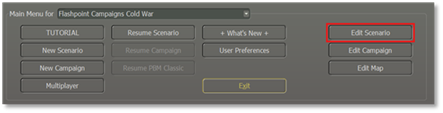The next popup window screen will show the Scenario Creation Checklist as shown below.

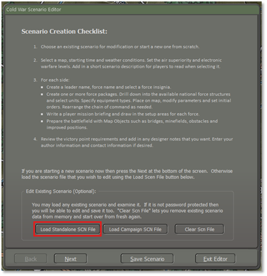

Select the “**Load Standalone SCN file**” button. To bring up the next popup window screen Module: Cold War: Southern Storm as shown below.

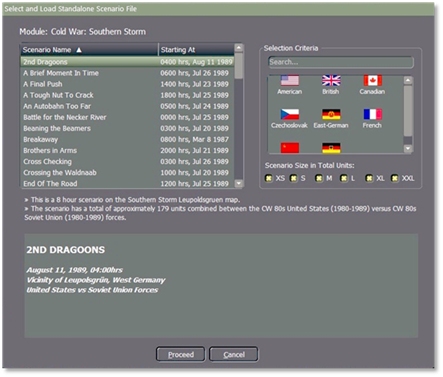

The core forces will be created in scenario 1 and then moved to each successful scenario. Additional core forces can be created in subsequent scenarios, and if a core force is not given a campaign scenario setup zone, then it will be removed from play.

Here we have selected the “**2nd Dragoons**” scenario as an example. Once highlighted, select the “**Proceed**” button.

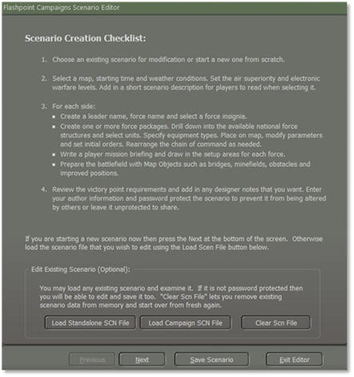

Then select the “**Next**” button to load the scenario that you select in this case “**2nd Dragoons**”.

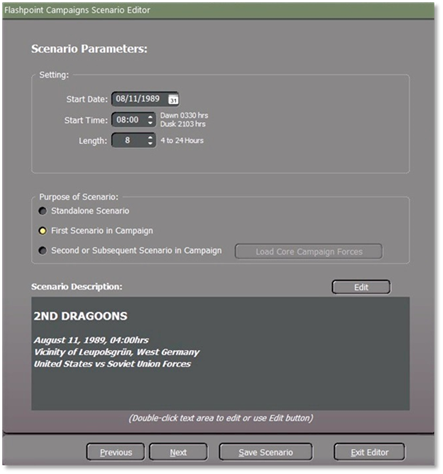

Now we need to select the” **Purpose of Scenario: First Scenario in** **Campaign**” button. Then select the “**Next**” button. The popup window we will need is the” Campaign Player1 Order of Battle”, in this case because we are doing a campaign with the US as the player. If it was a Warsaw Pact player, then we would have to show Player 2 Order of Battle instead.

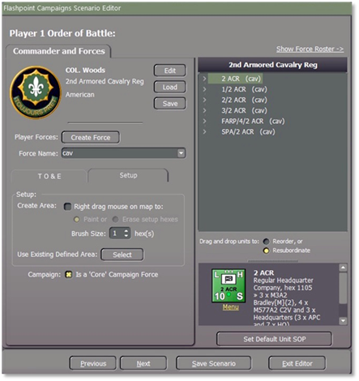

Forces can be marked as core from the “**Setup**” tab where there is a checkbox item for “**Is Core Campaign Force**”. If checked all units in that force (highlighted) or transferred into that force, will be designated as core units. Individual units cannot be set as core units. The unit must be highlighted to set as a core unit as shown in the example above. If you need to add another Unit to the Core Force, then you need to highlight each unit.

Make sure that when you do, you go to the Setup tab and select “**Is Core Campaign Force”** for each unit, for example, 1/2 ACR must be highlighted. Once you have finished selecting the Core Force for the Campaign select the “**Save Scenario**” button.

!!! note

    Core forces are tracked by force name so this cannot be changed later in the campaign. If a force starts as “2 ACR” as displayed in the example from above, then it must stay that way throughout the campaign.

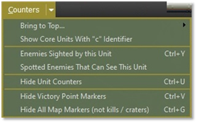

Unit counters can be displayed by selecting “**Show Core Units with “c”** **Identifier**” under the Counters Tab which when selected all core forces will be displayed with a lowercase “**c**” for “core” as needed so that the player can see which unit a core unit and which ones is not as shown below.

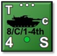   To create the next campaign scenario, start as you would any other new scenario, in this case, the scenario is titled “Dragoons” but when you get to the  “Purpose of Scenario”, check the (**1**) “**Second or Subsequent in Campaign**” radio button as shown below.

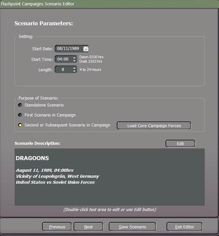

Then select (**2**) the “**Load Core Campaign Forces**” button. This will enable the Load Core Campaign Forces window popup which will list the various depot core forces available to you and let you select the core force from scenario one. As shown below.

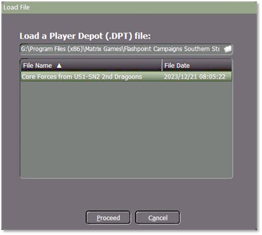

As part of the scenario creation process, you will need to create new setup zones for the core forces and deploy them to the map.  Do not change the core forces in any other way. Highlight the Core Force and then click on the “**Proceed**” button.

You can add additional friendly forces to the scenario, and these will be used but not rolled forward unless they are marked as “core”.  You may also deselect core forces so that they will no longer be carried forward.  Each time you save a campaign scenario it will create a new DPT file of the then core forces as “Core Forces from <scenario name>”.dpt.  This becomes the depot file (and not the first one you created) that you should roll forward to the next scenario.  *Yes, you do have to pay**some**attention to what you are doing, and if you start losing track of which depot file is which, your campaign will be mangled!*

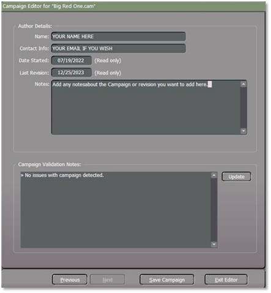

**1.** In the Author Details area, you can enter your Name (real name and forum handle), Contact information (an email address if you want folks to contact you or leave it blank), Date Started (you should populate with the date you start working on the scenario), Last Revision (date auto populates with today’s date), Notes (Any info about the scenario or changes made in the revision).

**2.** The Scenario Validation area notes any issues in your scenario that must be resolved before your scenario is playable in the game. Click on the Update button any time you make changes to see what items are still needed to have a complete scenario.

When you have finished then select the “**Save Campaign**” button.

## Naming of the Campaign Scenario

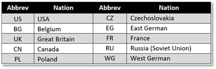   When naming the Campaign scenario to reflect the country, for example for a US campaign, you would name it as "US1 - SN1" (SN = scenario) for the first scenario, and for the next scenario, you would label it as US1 – SN2 and so on.
