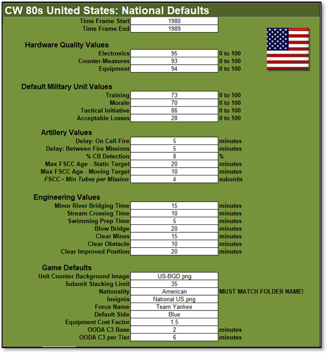
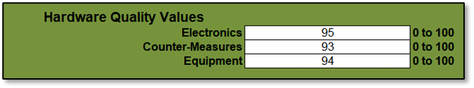
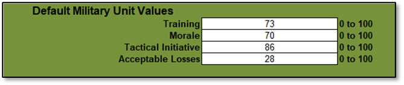
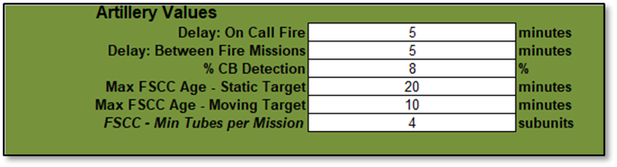
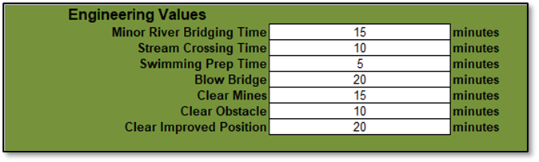
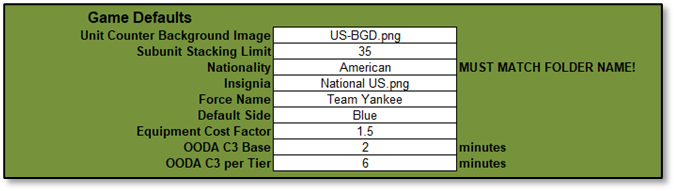

# National Defaults

These values represent certain abilities or game engine defaults which are specific to a given country in the game. Changes made to many of the values on this tab of the spreadsheet will impact on the overall play of units from this country.

## Time Frame Start/End

Sets the time frame reflected by this data set. Scenarios created in the editor must be set for this period. These are usually in ten-year increments, but in the case of recent modern data may cover a larger span of years.

## Hardware Quality Values

Relative measure of the technical competency of a country’s electronics and mechanical equipment. These values are used during certain engagements as a minor adjustment to characteristics found in the systems and units data tables.

### Electronics

Quality of electronic equipment such as sensors, radios, etc. used by a force (Quality set as on a scale of 0-100 with 100 being the best).

### Countermeasures

Quality of electronic countermeasures equipment for a force (Quality set as on a scale of 01-100 with 100 being the best).

### Equipment

Quality of general equipment not covered above for a force (Quality set as on a scale of 0-100 with 100 being the best).

## Default Military Unit Values

These are relative measures of a counties general/average fighting force soft factors (human element of the force). These factors influence several variables during simulation dealing with combat, orders, and command. These values can be set to different values for units in the Scenario Editor to reflect better or worse than average forces.

### Training

An identifier representing the average amount of training received. Scale of 0 (Untrained) to 100 (Elite) with 100 being the best.

### Morale

A number from 0 to 100 (best) represents the mental state of the unit at the beginning of the scenario. This value can drop during a battle and recover to a maximum of the preset value.

### Tactical Initiative

An indication of the unit’s freedom and initiative to assess the situation and act on their own at times in opposition to their given orders. The values range from 0 (No local initiative-stick with given orders) to 100 (total freedom locally). Unit SOPs (Standard Operating Procedures) can override this global setting.

### Acceptable Losses

Sets the force’s determination and ability to stand and fight and accept losses. The values range from 0 (No loss acceptance) to 100 (fight to the last man). Unit SOPs (Standard Operating Procedures) can override this global setting.

## Artillery Values

There are several settings to control the overall mechanics of a nation’s artillery support system. Values apply to both human control of support assets and the AI’s FSCC role if automated.

### Delay: On Call Fire

Additional Delay in minutes for the arrival of on call fire mission beyond the the delay for the command loops of spotter to battery.

### Delay: Between Fire Mission

Delay in minutes between fire missions. This time reflects the time required to set the target locations of a new fire mission.

### % CB Detection (Legacy)

The chance that an enemy fire mission will be detected, located, and possibly attacked by counter battery. This is your chance to be detected by the enemy and engaged based on SOP and shoot and scoot tactics.

!!! note

    This parameter will be replaced in the future with actual counter-battery capability with sensors and then passed to artillery units set to counter-battery operations.

### Max FSCC Age-Static Target

The time that a static (non-moving) target will remain in the FSCC queue once it is detected. The shorter the time, the more fresh the target mission calls will be.

### Max FSCC Age-Moving Target

The time that a moving target will remain in the FSCC queue. The shorter the time, the more up-to-date the mission targets will be, and the less likey rounds will hit an empty target hex.

### FSCC-Min Tubes per Mission

The minimum number of artillery tubes that an artillery battery must have available (not knocked out or destroyed) in order to execute an FSCC attack request.

## Engineering Values

These values cover various engineering functions and the length of time to perform these actions by capable Engineering type units.

### Minor River Bridging Time

This is the time it takes in minutes to lay a bridge of a hex side water obstacle with a short-span bridge.

### Stream Crossing Time

This is the time it takes in minutes to find and ford a shallow stream.

### Swimming Prep Time

This is the time it takes in minutes to prepare vehicles to swim a water obstacle.

### Blow Bridge

This is the time it takes in minutes to prepare a bridge for demolition and render the crossing impassable.

### Clear Mines

This is the time it takes in minutes to clear lanes in a minefield hex or edge obstacle so units can pass without loss.

### Clear Obstacle

This is the time it takes in minutes to clear obstacles (wire, logs, abatis, etc.) in a hex or edge so units can pass without delay.

### Clear Improved Position (IP)

This is the time it takes in minutes to remove and enemy improved position so it cannot be used by the enemy for added defense.

## Game Defaults

Important game related values that set certain use defaults or global parameters used by the game engine.

### Unit Counter Background Image

The default graphic file in the [Nations’s Data]/Backgrounds folder used as the counter background in-game for all units.

### Subunit Stacking Limit

The maximum number of subunits that the Nation’s forces are allowed to place in a single hex as a volume control measure.

### Nationality

This must be a unique name for a given Nationality and MUST be the same name of the Nation’s Folder in the Modules/Common/Data folder of the simulation. You may have any number of National XLS data files  in the folder as you like as long as they have a unique filename and have the correct Nationality entry (see below).

!!! warning
    The Nationality entry MUST match the name used for the folder or the game engine will not see or use the data file or possibly crash the game.

### Insignia

Default Graphic file in the Country’s Data folder for this force’s insignia. Insignia can be changed in the scenario editor.

### Force Name

Default name for the user’s Force. The name can be changed in the scenario editor.

### Default Side

Select **“**Blue” for Player 1 and “Red” for Player 2. This detemines the “side” the National data files will show up on in the scenario editor.

!!! note

    The number of availible sides is a feature we plan to increase in the future and this value may change or be depreicated.

### Equipment Cost Factor

This factor is multiplied with the cost of equipment/subunit for that side to determine the victory points that are awarded for the lost of said equipment/subunit. Most NATO (Blue) Nations will be above 1.0 and most Op-For (Red) countries will be below 1.0. This is a global VP cost multiplier and can be used to balance out force cost ratios.

### OODA C3 Base

The Base value represents the shortest amount of time in minutes required for a commander to make decisions/orders and implement it laterally to their staff or subordinates.

### ODDA C3 per Tier

The per Tier value represents the time in minutes required for orders to be transmitted and prossessed up or down the chain of command to the next level of forces.