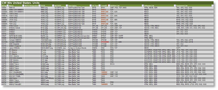
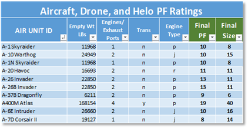

# Units

The Units tab is where each specific platform (aircraft, tank, infantry squad, etc.) is defined by a list of values, characteristics and pointers to other data used by the game engine to operate in the simulation.

## SUTag

The SUTag is an alphanumeric entry that must be a unique identifier for each entry. Our basic format is a two-character letter code for the country and then an integer value like “WG23”, or “UK357”.

***WARNING:*** *Once you set these values for a dataset and use it in the scenario editor, any edits, or reorders of the SUTags that break the initial SUTag-Platform relationship will cause existing scenarios to load bad data if you update a scenarios data with a corrupted dataset with remapped SUTags. If you need to add more platforms between entries (for data consistency/appearance) You should add to the code with additional alphanumeric characters. For example, if you had “UK357” and “UK358” in your list and wanted to add in two more variants, you can add rows to the spreadsheet in between them and use SUTags like “UK357A” and “UK357B”. You could also add a new value greater than the largest one in the SUTag list.*

## Name

This is the given identification of a specific platform or squad as used by its nation. For example, “M1A1 Abrams”, “T-80BV, “Challenger”, etc.

## NATO Designation

This is a platform’s specific NATO designation, if one exists. For example, SA-3 Goa (for an S-125 Neva). This field is included to allow for most OpFor hardware of Russian origin to carry its given NATO designated code and name. It can also be used for alternate names used by countries for other countries’ hardware.

## PICID

This is the filename of the unit’s silhouette image or NATO standard icon for squads. The images are in Modules\Common\Data\Common Folder. Images specifications can be found in the Game Engine Modifications document.

## NATOPIC

This is the filename for the NATO standard icon for all units. The images are in Modules\Common\Data\NATO Folder. Images specifications can be found in the Game Engine Modifications document.

## Description

This is a concise description explaining the platform’s type and function. For example, “Main Battle Tank”, “Wheeled APC”, etc. This description is displayed in the Sub-Unit Inspector and in several other information panels.

For aircraft, drones, and helicopters, the description is followed by a dash and then a list of weapon types carried to help the user see the various loadouts. As an example, the US F-16D Close Air Support aircraft has a Description of “CAS Aircraft - Can/FAE/IB” denoting the aircraft has a Cannon, Fuel Air Explosive bomb, and Iron Bombs as its weapons.

## SU Type

The Platform Type (Subunit Type or SU Type) is the unique classification of the unit based on the values found in Section 4 above.

***WARNING:*** *A unit MUST have one of these codes for the game to recognize it and employ it properly. Users cannot add their own SU Types to the game as it requires supporting code.*

## CompID

Composition ID or CompID is a user generated value used to help define types and subtypes of platforms that are used in the creation of formations. In most cases, this is the same as the SU Type.

In certain cases, if you need to highlight or set apart a platform unit(s) you can make your own alphanumeric identifier. This CompID then can be used in a formation composition and only those units with the particular CompID will show in the selection screen in the Scenario Editor.

## First Year Avail

This is the year in which the unit entered service in useful numbers. Based on scenario start date, any unit whose start date is greater than the scenario date will not display in the selection window.

## Last Year Avail

This is the last year in which the unit served in useful numbers. Based on scenario start date, any units whose end date is less than the scenario date will not display in the selection window.

## Crew

This is the number of personnel used to man a particular platform or system. This does not include passengers.

## Mobility

This value indicates the type of propulsion/movement used by a particular unit. Refer to 12 above for the valid types. This value is used in several movement calculations and ability checks when units move in the game.

## Speed

This is the top speed (in km/hr) of the platform. Movement on the ground for most types of movement orders is much less than the maximum speed entered as the game considers slower movement rates when in a combat area and based on the type of movement order the units are following. Speed for aircraft, drones, and helicopters will factor in its defensive capability in combat engagements.

## Transport (Organic)

For a positive value, this is the number of passenger units that can be loaded on a particular platform. For a negative number, this is the relative amount of space taken up by the unit to be transported. To see if a unit can be loaded on a transport, you add a positive transport value to the negative transport value(s) and must be greater than or equal to zero. For example, you can load a US HMMWV (Transport = 2) with two Sniper Teams (Transport = -1) or one Scout unit (Transport = -2).

**NOTE:** Organic Transport is used for mechanized forces to keep IFVs and troops in a cohesive unit. We have added a Tactical Transport (TT) feature for ad-hoc transport of troops and also to support air assault operations.

## Size

This factor is a relative measure of volume for the unit in question. Size is used in both spotting and combat to modify certain calculations.

For leg units this is equal to 0 for 1-4 Crew, 1 for 5-8, and an additional +1 for every 4 Crew.

For vehicles and weapon systems, find a unit of similar size in an existing listing and use that number.

For Air Units, please use the Aircraft Values Spreadsheet to get the size rating.

**NOTE:** This new attribute is still being worked on and may see some values change as we improve the method of calculations (especially for ground vehicles.

## Mass

Mass is the weight of the vehicle or squad in pounds (US). Squads are based on 250 pounds per person, weapon, and engineering teams at 300 pounds a person, and vehicles based on empty weights rounded to the nearest 100 pounds. This value is used to determine if the unit can be carried by a transport vehicle (via Tactical Transport) or how many can be carried based on the transport’s Internal and External Weight limits. All Units require a Mass value.

## IntTrp

Internal Troops (IntTrp) is the maximum number of troops that a transport can carry internally. This value is only used on units that are using the Tactical Transport feature and not an organic transport unit type.

## IntWt

Internal Weight (IntWt) is the maximum weight that a transport can carry internally. This value is only used on units that are using the Tactical Transport feature.

## ExtTrp

External Troops (ExtTrp) is the maximum number of troops that a transport can carry externally. This value is only used on units that are using the Tactical Transport feature and not an organic transport type.

## ExtWt

External Weight (ExtWt) is the maximum weight that a transport can carry externally (like a sling load on a helicopter). This value is only used on units that are using the Tactical Transport feature.

## FC/RF

This is a relative measure of a unit’s Fire Control/Range Finder (FC/RF) systems. The range of value is 0 (no system) to 20 (future ultra-AI sensor fusion). This value is used in combat when working out the chance to hit calculations.

## Stab

The Stab (Stability) value is used to rate a unit’s ability to fire accurately at a moving target while moving itself. Stab value ranges from 0 (no stability system) to 10 (fully stabilized, accuracy remarkably close to static target and static shooter). Values in the middle can be used for units with lesser stabilization systems.

For air SU Type systems, AIRAT and AIRSD are set to 5, AIRLB are set to 7, AIRGS are set to 9, AIRUT are set to 3, Drones (HELOSC/AIRAT) are set to 8, Unarmed HELOs are a 0, Armed are 5 through 9 depending on unit use and technology level. Most purpose-built attack helicopters will be an 8.

## The Characteristics Lists

There are three columns in the data file devoted to lists of parameters. The first three deal with Abilities, Defenses, and Equipment Platform Characteristics. As you can see from the image below, these lists can be rather lengthy.

### Abilities List

These Characteristic Codes are broken down into four functional groups and the lists and descriptions of these codes can be found in Section 5.1 above. These groups are Abilities-Engineering, Abilities-General, Abilities-Transport, and Abilities-Logistical. If your unit in question has any of the abilities found in these lists, you add them to a comma delimited list in the Abilities List spreadsheet field.

### Defenses List

These Shared Characteristic Codes are broken down into three functional groups and the lists and descriptions of these codes can be found in Section 5.1 above. These groups are Defenses-Abilities, Defenses-Countermeasures, and Defenses-Protection. If your unit in question has any of the defenses found in the lists, you add them a comma delimited list in the Defenses List spreadsheet field. A number of these Shared Characteristic Codes are used in setting the levels of unit protection and will have additional explanation in Section 18.26 below of this document.

### Equipment List

These Shared Characteristic Codes are broken down into two functional groups and the lists and descriptions of these codes can be found in Section 5.1 above. These groups are Equipment-Receivers, Equipment-Sensors, Equipment-Target Acquisition, and Equipment-Weapon Locating Sensors. If your unit in question has any of the equipment found in the lists, you add them a comma delimited list in the Equipment List spreadsheet field.

## Integrated Weapons List

This final list is different from the other three as it is a listing of the weapons/systems carried and the amount of ammunitions/uses each weapon/system has, in a comma delimited list. There are two types of entries for the weapons list depending on is a weapon/system has variable munition or not. The setup of the information is as follows.

### System with Single Ammo Allocation

The format is the WEAPTAG code and then the “\*” sign and a value for the amount of ammunition. The amount of ammunition is rounds for items that fire single shot (artillery guns, tank guns, PGMs, ATGMs, etc.) or in bursts for multi-round shooting weapons.

The following is an example of an AH-64A Apache Attack Helicopter. In this case, with an autocannon with 58 bursts and 4 Hellfire mounts with 4 ATGMs on each mount:

AUCN9\*58, ATGM10\*4, ATGM10\*4, ATGM10\*4, ATGM10\*4

### System with Munitions

The format is the WEAPTAG code and then the “:” sign followed by a semi-colon (;) separated listing of munitions with AmmoTypeID followed by the “\*” sign and number of rounds carried of that type of munition. This gun system is separated by a common to other systems in the listing such as the machine guns in this example.

The following is an example of a M551 Sheridan with multiple rounds for the tank gun. In this case, with a tank gun with three types of munitions for the gun (6 HE rounds, 12 HEAT rounds, and 11 ATGM rounds) for the TGN14M weapon system and two machine guns (AAA11 and VSW3) with single ammo allocations:

TGN14M: TGN14M\_HE\*6; TGN14M\_HEAT\*12; TGN14M\_ATGM\*11, AAA11\*90, VSW3\*120

### Ammunition Allocation

Ammunition allocations are based on the type of weapon system and characteristics of the platform the weapon system is part of. We have several types of weapon systems and ways to estimate/calculate the amount of ammunition for each as follows:

- **Small Arms, Single Shot** – For pistols and rifles a rough estimate based on the number of rounds in the weapon and a few carried clips/rounds to reload it. These are very rough estimates and due to the scale of the game, not required to be spot on exact. As the data person, you can decide how “correct” an amount is per weapon.

- **Small Arms, Burst/Auto Fire** – Like single shot small arms, the value in this case is based on the burst fire of the weapon. So if the weapon has a 30 round clip and general fire in 3 shot bursts, you have a 10 ammunition allocation value. Then add in for additional clips/magazine held by the soldier. Again, this is a rough estimate for all small arms.

- **Rapid Fire Systems** – For Weapon Systems like Anti-aircraft Guns, Machine Guns, and Autocannons using a rough estimate of number of bursts of ammunition is what is used. The best way to decide is to find a similar system in the game data files and use a value of the same magnitude.

- **Single Shot Infantry Weapons** – These weapons are systems like RPGs, grenades, or satchel charges and similar troop weapon systems. For these items the units will carry usually a small number of these items. For RPG0like anti-tank weapons, they should be listed multiple times with 1 ammo as these are normally volley fired at armored vehicles.

- **Missiles, Rockets, Bombs** – For these discreet weapon systems, the number of munitions should equal the amount the platform carries and can vary depending on platform configurations, especially aircraft. For example, an American AH64 Apache may carry 16, 8, or 0 Hellfire ATGM missiles depending on loadout. Loadout information is readily available for most platforms on the internet with a search.

- Tube

## PF (Protection Factor)

Depending on the type of unit, the Protection Factor (PF) represents the unit’s basic armor or toughness when hit with weapons fire. There are several Characteristics that augment the PF rating of certain units, and the determination of those Characteristics is covered in more detail in Section 18.26 below.

### PF for Soft Units

If the unit is leg mobile (squads and teams), towed or crew served weapon (Field gun, anti-tank gun, etc.), static weapon system (SAMWS), or Decoy the PF rating for the unit is 0. These units gain protection based on the cover they are in and their orders state.

### PF for Air Units

All Air units have a PF generated by a secondary spreadsheet called Air Unit PF Ratings. You will need to know the Empty Weight in pounds, number of Exhaust Ports (engines or engines and VTOL exhaust ports), is the unit a Transport (they have larger size per pound since they carry cargo), and Engine Type (p-Prop, r-Rotor, j-Jet/Rocket). You can add more air units to the spreadsheet as needed. See Section 18.27 for more detailed instructions.

### PF for Ground Vehicle Units

The new game engine works on a 1 PF per 10mm of RHA equivalent kinetic armor protection. For most lightly armored vehicles this will be 1 to 5 (10 to 50mm protection). To calculate a PR rating for a more heavily armored AFV you will want to have data on the frontal thickness of hull and turret armor versus kinetic rounds in millimeters of RHA. Chemical/HEAT and ERA/NERA type augmentations will be covered in Section 18.26 below of this document. You may need to make some estimation of the value if the data is more detailed by area information. With values for both turret and hull frontal in millimeters or just hull if no turret is present, divide by 10 to get the base PF ratings. If there is a turret, use the turret value for the base PF, else use the Hull PF value for the PF Rating. Hold on to the Hull PF value if a turret present as it will be used in Section 18.26 below calculations.

## Defining Armor Value and Specials

Based on the value(s) obtained in Section 18.25.3 above either a Hull PF or a Turret PF and associated Hull PF was generated. In the case of a pure hull design the Hull PF rating was entered in the data sheet. If a turret was present on the AVF platform the Turret PF rating was entered in the data sheet. This is a very basic kinetic resistance value, and we use several Characteristics to account for the other more advanced aspects of armor coverage. The following sections will cover these additional aspects.

### Hull to Turret Ratio (HTR)

The HTR Characteristics are located in the Defensive Abilities listing and are defined in the following table. This code allows the game engine to calculate a PF for the hull based on the Turret PF and this code.

|  |  |  | | --- | --- | --- | | **Code** | **Unit Special Description** | **Notes** | | HTR1 | Hull to Turret Ratio, Type 1 | Ratio is <.60 for Hull PF / Turret PF rating, -50% to PF adjustment for hull hits | | HTR2 | Hull to Turret Ratio, Type 2 | Ratio is .60 to .75 for Hull PF / Turret PF rating, -30% to PF adjustment for hull hits | | HTR3 | Hull to Turret Ratio, Type 3 | Ratio is .75 to .90 for Hull PF / Turret PF rating, -15% to PF adjustment for hull hits | | HTR4 | Hull to Turret Ratio, Type 4 | Ratio is .90 to 1.10 for Hull PF / Turret PF rating, no adjustment for hull hits | | HTR5 | Hull to Turret Ratio, Type 5 | Ratio is 1.10 to 1.25 for Hull PF / Turret PF rating, +15% to PF adjustment for hull hits | | **Code** | **Unit Special Description** | **Notes** | | HTR6 | Hull to Turret Ratio, Type 6 | Ratio is 1.25 to 1.40 for Hull PF / Turret PF rating, +30% to PF adjustment for hull hits | | HTR7 | Hull to Turret Ratio, Type 7 | Ratio is >1.40 for Hull PF / Turret PF rating, +50% to PF adjustment for hull hits |

To determine which value to use, calculate Hull PF / Turret PF and consult the range in the Notes Field. If the value falls into the range of HTR4 (near 1.0) you do not need to add this special to the Defenses List of the unit.

### Advanced Composite Armour (ACA)

The ACA Characteristics are in the Defensive Protection listing and are defined in the following table. This code allows the game engine to augment the PF rating against HEAT based rounds based on location (hull or turret) and aspect (Front, Side, Rear, and Top).

**NOTE:** You can assign more than one of these codes in the Defenses List of a unit if there is a variable level of coverage based on location and aspect.

|  |  |  | | --- | --- | --- | | **Code** | **Unit Special Description** | **Notes** | | ACAH1 | Advanced Composite Armour (Effectiveness 1) | <1.25 ratio, Hull, Aspect Coded (F/S/R/T) | | ACAH2 | Advanced Composite Armour (Effectiveness 2) | <1.25 : 1.5 ratio, Hull, Aspect Coded (F/S/R/T) | | ACAH3 | Advanced Composite Armour (Effectiveness 3) | <1.5 : 1.75 ratio, Hull, Aspect Coded (F/S/R/T) | | ACAH4 | Advanced Composite Armour (Effectiveness 4) | <1.75 : 2.0 ratio, Hull, Aspect Coded (F/S/R/T) | | ACAH5 | Advanced Composite Armour (Effectiveness 5) | >2.0 ratio Hull, Aspect Coded (F/S/R/T) | | ACAT1 | Advanced Composite Armour (Effectiveness 1) | <1.25 ratio, Turret, Aspect Coded (F/S/R/T) | | ACAT2 | Advanced Composite Armour (Effectiveness 2) | <1.25 : 1.5 ratio, Turret, Aspect Coded (F/S/R/T) | |  |  |  | | **Code** | **Unit Special Description** | **Notes** | | ACAT3 | Advanced Composite Armour (Effectiveness 3) | <1.5 : 1.75 ratio, Turret, Aspect Coded (F/S/R/T) | | ACAT4 | Advanced Composite Armour (Effectiveness 4) | <1.75 : 2.0 ratio, Turret, Aspect Coded (F/S/R/T) | | ACAT5 | Advanced Composite Armour (Effectiveness 5) | >2.0 ratio Turret, Aspect Coded (F/S/R/T) |

To determine which value to use, a calculation of the ratio of the HEAT resistance to Kinetic resistance for the location and aspect needs to be done and then compared to the table to get the correct basic ACA code. To complete an ACA code, add the Aspect Letters after the 1-5 effectiveness value.

For example, if you have an “ACAH3” (hull ACA with a ratio between 1.5 and 1.75) and it covers front and side only the full code will be “ACAH3FS”.

### Explosive Reactive Armour (ERA)

The ERA Characteristics are located in the Defensive Protection listing and are defined in the following table. This code allows the game engine to augment the HEAT or Kinetic AP penetration value of an incoming round based on location (hull or turret) and aspect (Front, Side, Rear, and Top). You can also use these codes for NERA protection as well.

**NOTE:** You can assign more than one of these codes in the Defenses List of a unit if there is a variable level of coverage based on location and aspect.

|  |  |  | | --- | --- | --- | | **Code** | **Unit Special Description** | **Notes** | | ERAH1 | ERA - Hull, Type 1, Aspect (Front/Side/Rear/Top) | Explosive reactive armor, early type, CE only - Kontakt-1, Hull, Aspect Coded (F/S/R/T) | | ERAH2 | ERA - Hull, Type 2, Aspect (Front/Side/Rear/Top) | Explosive reactive armor, early type, CE only - Kontakt-3, Hull, Aspect Coded (F/S/R/T) | | **Code** | **Unit Special Description** | **Notes** | | ERAH3 | ERA - Hull, Type 3, Aspect (Front/Side/Rear/Top) | Explosive reactive armor, late type, CE/KE - Kontakt-5 (85+), Hull, Aspect Coded (F/S/R/T) | | ERAH4 | ERA - Hull, Type 4, Aspect (Front/Side/Rear/Top) | Explosive reactive armor, late type, CE/KE - Relikt (06+), Hull, Aspect Coded (F/S/R/T) | | ERAT1 | ERA - Turret, Type 1, Aspect (Front/Side/Rear/Top) | Explosive reactive armor, early type, CE only - Kontakt-1, Turret, Aspect Coded (F/S/R/T) | | ERAT2 | ERA - Turret, Type 2, Aspect (Front/Side/Rear/Top) | Explosive reactive armor, early type, CE only - Kontakt-3, Hull, Aspect Coded (F/S/R/T) | | ERAT3 | ERA - Turret, Type 3, Aspect (Front/Side/Rear/Top) | Explosive reactive armor, late type, CE/KE - Kontakt-5 (85+), Turret, Aspect Coded (F/S/R/T) | | ERAT4 | ERA - Turret, Type 4, Aspect (Front/Side/Rear/Top) | Explosive reactive armor, late type, CE/KE - Relikt (06+), Turret, Aspect Coded (F/S/R/T) |

In order to determine which value to use, select the type that best matches the performance of the listed types for the location (hull or turret) and aspect. To complete an ERA code, add the Aspect Letters after the 1-4 effectiveness value.

For example, if you have an “ERAH4” (hull ERA with a performance like Relikt) and it covers front and side only the full code will be “ERAH4FS”.

### HEAT Resistant Armour (HRA)

The HRA Characteristics are located in the Defensive Protection listing and are defined in the following table. This code allows the game engine to augment the HEAT PF value of the armor for systems with enhanced HEAT protection versus a lighter kinetic protection (hull or turret) and aspect (Front, Side, Rear, and Top). This type of armor is mainly found on IFVs and APCs.

!!! note

    You can assign more than one of these

codes in the Defenses List of a unit if there is a variable level of coverage based on location and aspect.

|  |  |  | | --- | --- | --- | | **Code** | **Unit Special Description** | **Notes** | | HRAH1 | HEAT Resistant Armor-Hull, Type 1, Aspect (F/S/R/T) | Reduced HEAT - >3 and <= 6 ratio (C/K), Hull, Aspect Coded (F/S/R/T) | | HRAH2 | HEAT Resistant Armor-Hull, Type 2, Aspect (F/S/R/T) | Reduced HEAT - >6 and <= 9 ratio (C/K), Hull, Aspect Coded (F/S/R/T) | | HRAH3 | HEAT Resistant Armor-Hull, Type 3, Aspect (F/S/R/T) | Reduced HEAT - >9 and <= 12 ratio (C/K), Hull, Aspect Coded (F/S/R/T) | | HRAH4 | HEAT Resistant Armor-Hull, Type 4, Aspect (F/S/R/T) | Reduced HEAT - >12 and <= 15 ratio (C/K), Hull, Aspect Coded (F/S/R/T) | | HRAH5 | HEAT Resistant Armor-Hull, Type 5, Aspect (F/S/R/T) | Reduced HEAT - >15 ratio (C/K), Hull, Aspect Coded (F/S/R/T) | | HRAT1 | HEAT Resistant Armor-Turret, Type 1, Aspect (F/S/R/T) | Reduced HEAT - >3 and <= 6 ratio (C/K), Turret, Aspect Coded (F/S/R/T) | | HRAT2 | HEAT Resistant Armor-Turret, Type 2, Aspect (F/S/R/T) | Reduced HEAT - >6 and <= 9 ratio (C/K), Turret, Aspect Coded (F/S/R/T) | | HRAT3 | HEAT Resistant Armor-Turret, Type 3, Aspect (F/S/R/T) | Reduced HEAT - >9 and <= 12 ratio (C/K), Turret, Aspect Coded (F/S/R/T) | | HRAT4 | HEAT Resistant Armor-Turret, Type 4, Aspect (F/S/R/T) | Reduced HEAT - >12 and <= 15 ratio (C/K), Turret, Aspect Coded (F/S/R/T) | | HRAT5 | HEAT Resistant Armor-Turret, Type 5, Aspect (F/S/R/T) | Reduced HEAT - >15 ratio (C/K), Turret, Aspect Coded (F/S/R/T) |

To determine which value to use, a calculation of the ratio of the HEAT resistance to Kinetic resistance for the location and aspect needs to be done and then compared to the table to get the correct basic HRA code. To complete an HRA code, add the Aspect Letters after the 1-5 effectiveness value.

For example, if you have an “HRAT3” (turret HRA with a ratio between 9.0 and 12.0) and it covers front, side, and top, the full code will be “HRAT3FST”.

### Skirt Armour (SKT)

The SKT Characteristics are located in the Defensive Protection listing and are defined in the following table. This code allows the game engine to augment the HEAT or Kinetic AP penetration value of an incoming round based on location (hull or turret) and considered to be Side and Rear only aspects.

**NOTE:** You can assign more than one of these codes in the Defenses List of a unit if there is a variable level of coverage based on skirt type and location of coverage.

|  |  |  | | --- | --- | --- | | **Code** | **Unit Special Description** | **Notes** | | SKTHL | Armoured Skirt Hull sLats | used for slat style skirts that degrade AP and HEAT weapons | | SKTHP | Armoured Skirt Hull Plate | used for plate style skirts that degrade AP and HEAT weapons | | SKTHS | Armoured Skirt Hull Spaced | used for spaced plate style skirts that degrade AP and HEAT weapons | | SKTHW | Armoured Skirt Hull Wire | used for wire style skirts that degrade AP and HEAT weapons | | SKTTL | Armoured Skirt Turret sLats | used for slat style skirts that degrade AP and HEAT weapons | | SKTTP | Armoured Skirt Turret Plate | used for plate style skirts that degrade AP and HEAT weapons | | SKTTS | Armoured Skirt Turret Spaced | used for spaced plate style skirts that degrade AP and HEAT weapons | | SKTTW | Armoured Skirt Turret Wire | used for wire style skirts that degrade AP and HEAT weapons |

To determine which value to use, select the type of skirt that best represents the setup on the unit.

### Values for Side and Top/Rear

There are two internal global values used in the game. For a side aspect shot the basic PF value is multiplied to 0.46 and for the top and rear time 0.21. Both numbers are based on looking at many post WW2 tanks and these were the majority breakpoints for those aspects.

## Air Unit Size and PF Rating Calculator

As noted earlier in this document. The Size and PF rating for Air Units is derived from some input parameters and some calculations to put both factors into values that work within the game engine. You can use this table one of two ways. The first is to see if your platform is already on the list of over 600 aircraft, drones, and helicopters on our existing list (We will be adding more entries over time of course). Alternately, you can add more entries into the spreadsheet by supplying a few key parameters as noted below.

### Adding More Data

- Go to the bottom of the table and add in a new row by dragging the table corner marker (in the bottom left side of the table) down to add in new rows.

- In the Air Unit ID field, add the name of the platform you wish to add.

- In the Empty Wt LBs field, enter the empty weight of the platform in pounds (US).

- In the Engine/Exhaust Ports field, enter the number of engines/power plants on the platform. Also include additional VTOL exhaust ports (For example, the Harrier has a 4-port system but no main power plant exhaust so a value of 4 will be used).

**NOTE:** For any Glider based platform you must enter “1” in the Engines field for the calculations to work. The Glider functionality will be resolved by the platform AIRGL SU Type.

- In the Trans field, place a “y” if the platform is a transport of some kind and “n” if it is not. A transport is defined as any platform that carries internal cargo beyond its operating crew. So, a Mi-24 Hind is a transport (carries troops), but a Mi-28 Havoc is not.

- In the Engine Type field, place “r” is the primary engine system is a Rotor, “p” if it is a Propeller, and “j” if it is a Jet/Rocket”.

**NOTE:** for a Glider enter “p” so the program calculates properly.

**NOTE:** In cases of a hybrid engine setup, choose Jet over Rotor and Propeller, or choose Rotor over Propeller.

- A value for the Final PF Rating and the Final Size with be shown in the last two fields. Transfer these results to the Units Data sheet for the platform you added.

- You may wish to sort the table by the Air Unit ID once you have recorded the new entries.

***WARNING:*** *There are calculations hidden between column G and O in the spreadsheet. If you want to change or experiment on matching up the Sizes and PFs in a different way you are free to edit things. Make a backup first.*