# Sil Making 101

This is a quick step-by-step on making a unit sil (silhouette) using an image from the internet and third party paint tools, in this case Corel PaintShop Pro 2023 (others may work as well if they have similar tools).

## Find an Image

Made a lot easier these days with the internet and a search engine. In this example we are going to do a BMP-2. We are looking for an image with the following qualities:

- Width greater than 256 pixels with 512 or greater being preferable to capture details.

- A clean side view of the vehicle.

- Already blacked out is a plus, but an image with a single color background or transparent makes life easier.

!!! note
    In some cases, certain hard to find units may require taking a

real image and cleaning the background out and making some other adjustments to get a decent side view.

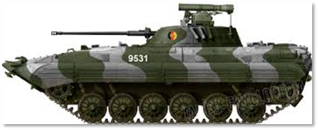

Here is a good BMP-2 image from the internet.

## Process in the Art Program

Here are the steps and tools I use with PaintShop Pro to get to a final sil for the game. With good images I can make a sil in about 30-45 seconds with all the tools on the pallet.

1. Copy and paste or save and load the located image into the paint program.

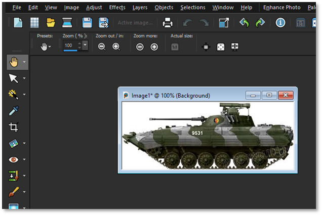

2. Using the Magic Wand Selection Tool, click on the white (solid color) to select the background.

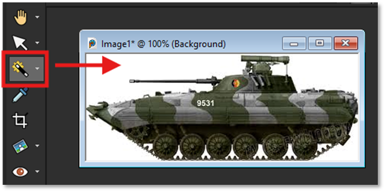

3. Invert the selection to isolate the unit in the image. If there is a color on the unit the matches the background, in this case the white numbers, those will get “removed” and we will have to fill that area in later in the process. You could also just “paint” over the numbers with a non-white color before inverting to also deal with the issue.

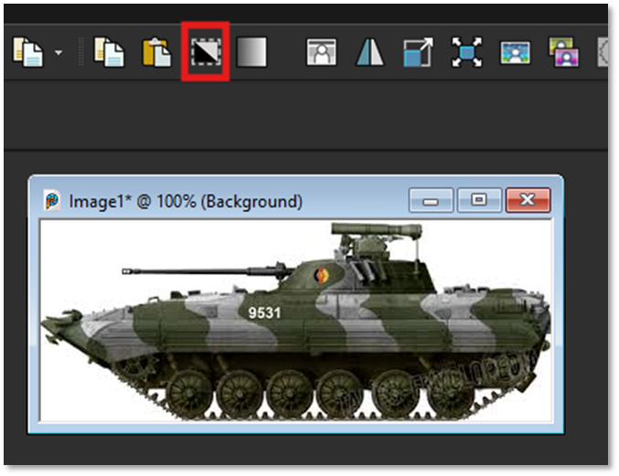

4. Now select the Copy button to grab the isolated unit image and then hit Paste (New Image) to place the background removed image in a new image window to work on further.

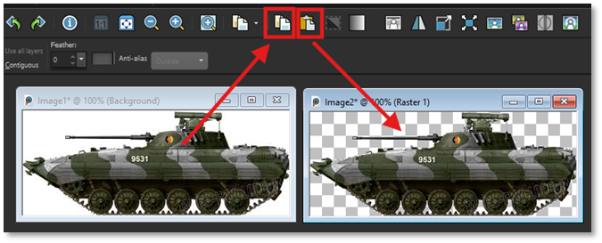

5. With the new unit image selected, select the Lighten/Darken tool, then darken the image until it is all black. As we noted you can see some of the white numbers on the hull of the vehicle. To remove this, select the paint brush and pain over the area in black (RGB: 0/0/0).

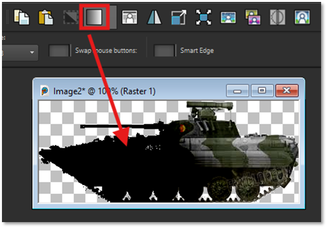

6. Next, Select Grey Scale to reduce the color pallet down to grayscale and reduce the memory required to save the image.

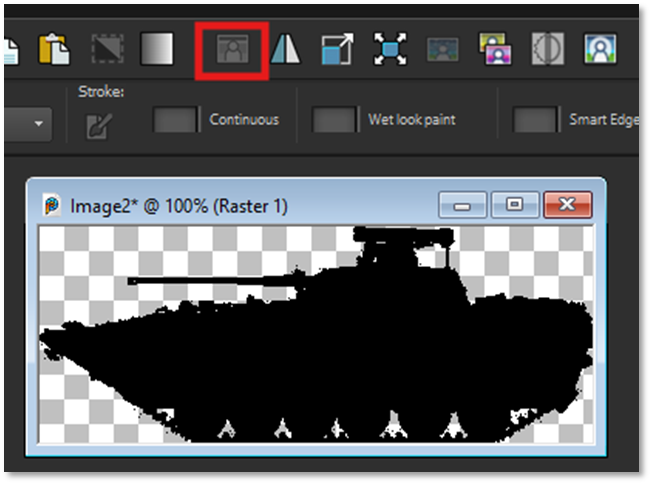

7. Now we need to face the image to the right. The game automatically sets the direction based on the side in the game. Click the Flip Horizontal tool to face the image to the right.

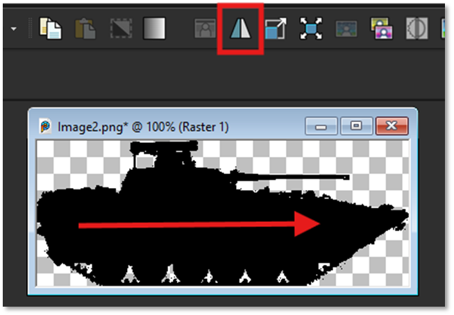

8. Next, we need to scale the image to fit to the counter. Click on the Resize tool (Red Box) and open the dialog. In the Width field (Blue Box) set it to 236 pixels. Allow the height to auto change with the Aspect Ratio locked. If the Width (Gold Box) is greater than 110 pixels set it to 110 and let the height scale (less than 236 and this is okay).

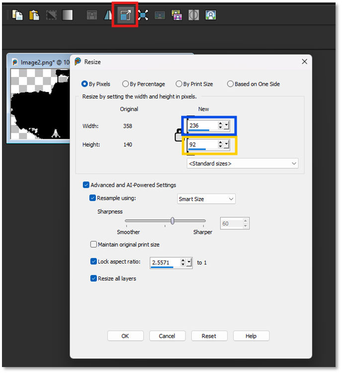

9. Now we need Resize Canvas to place and center the image. Click Resize Canvas tool (Red Box) and open the dialog. Make sure Lock Aspect is unchecked. Set the Width to 256 pixels and the Height to 128 pixels (Gold Box). For Placement (Green Box), select bottom center. In the Bottom field (Blue Box) set it to 4 pixels. This will set the final size for the unit image.

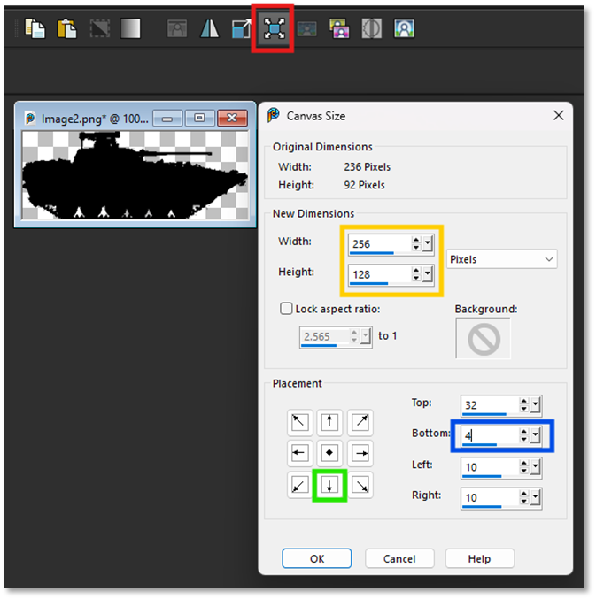

1. Here is the image after the Resize Canvas. Note the 4 pixel spacing under the vehicle.

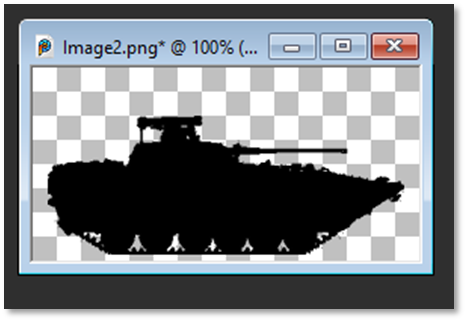

1. Now select the Save As button and save the final image in PNG format
and with a name that describes the vehicle well for later use in the data files. In this case, “BMP2AT5.png” will work well. Save the image in the Common/Data/Common folder if it is to be used in the game.

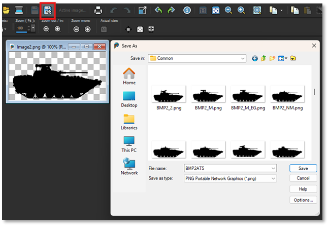

We are done and ready to do the next image. Good luck!

## Making NATO Style Counter Art

For making the NATO Style counter art images, base your layout using a copy of one found in the [Module Name]/Sils or Modules/Common/Data/NATO folder.

There are both Standard and Hostile versions for each counter.

These images are black and white and have a sizable number of pixels around all sides of the image as a buffer on the counter as seen in the example below.

Image size should be 256 x 128 pixels like the vehicle images and saved in a PNG format.

### Standard NATO Friendly Art

These images are named with an “NS-” prefix and saved in the NATO folder.

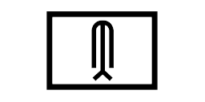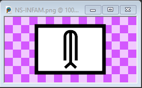

### Standard NATO Hostile Art

These images are named with an “H-” prefix and saved in the NATO Folder.

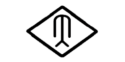 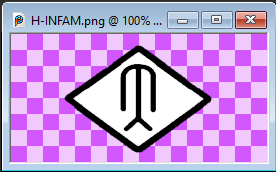

### Infantry-Based Counter Art

These images are named with an “\_” prefix and saved in the Sils Folder. These are only required for non-vehicle images and used when the game is showing silofettes instaead of NATO symbols.

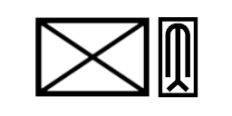 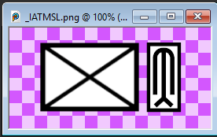

!!! note
    The image above is an infantry-based weapon team with the key weapon noted to the right in the narrow rectangle. Other unit types exist that do not use a weapon symbol.

### Steps to Create New NATO Style Art

Depending on the type(s) you need to make, do the following:

- Copy one of the images out of the folders noted above

- Paint over any of the center art in white if you need to remove what is there

- Add in the new symbol or letters in black trying to match font size and line thickness

- Save the new art image in the noted folders with the correct prefix

!!! note
    To use these new images, add the filename to the data file(s) for it to show up with the correct unit.

!!! note
    The game includes a great number of NATO based artwork and should already cover the majority of unit types that can appear in the game.