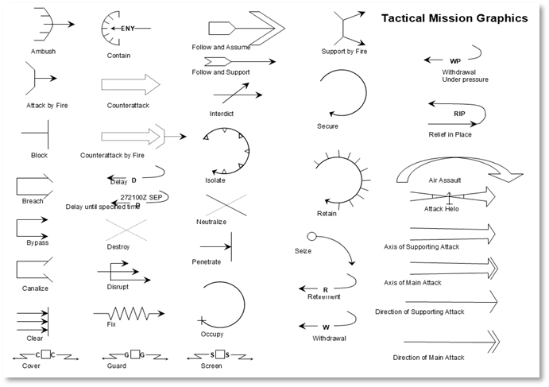
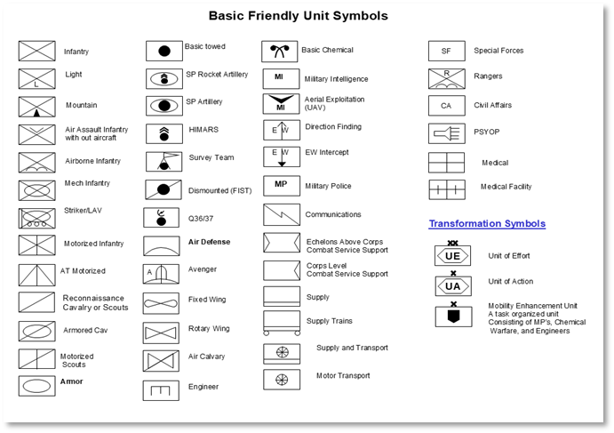
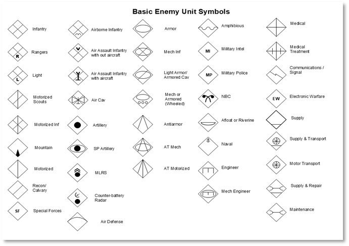
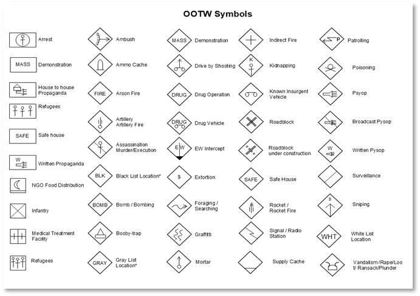

# Appendices

## A1 – Glossary of Terms

| Term | Definition |
| --- | --- |
| **AO (Area of Operations)** | The defined geographical area where a unit conducts operations. |
| **Briefing Overlay** | A transparent image layer placed over a base map, showing military graphics, routes, or objectives. |
| **FASCAM (Family of Scatterable Mines)** | Artillery delivered or air dropped minefields used to disrupt or deny enemy movement. |
| **FSCL (Fire Support Coordination Line)** | A control measure used to coordinate joint fires across unit boundaries. |
| **FSCC (Fire Support Coordination Center)** | The staff section responsible for managing indirect fire assets. |
| **Kill Zone** | An area designated to concentrate firepower to destroy an enemy force. |
| **Overlay** | A graphical representation of military plans placed over a base map. |
| **SOP (Standard Operating Procedure)** | A standard method used by units to carry out specific tasks or operations. |
| **Staff TOC (Tactical Operations Center)** | The central location where commanders and staff plan and monitor operations. |
| **TOC (Tactical Operations Center)** | The main command post from which a unit conducts planning and coordination. |
| **Unit Dashboard** | The interface panel in the game that shows status, orders, and details for a selected unit. |

## A2 – Acronyms and Abbreviations for Overlay Tools

### General PowerPoint Terms*

| Abbreviation | Meaning |
| --- | --- |
| **PPT** | PowerPoint (file or software) |
| **PPTX** | PowerPoint XML file format (modern format) |
| **SL** | Slide |
| **MBR** | Master Background (base map or reference image) |
| **ELT** | Element (graphic object such as a symbol, arrow, or text box) |
| **GFX** | Graphics (a generic term for visual elements) |
| **LYR** | Layer (grouped graphic elements, e.g., Fire Support Layer) |
| **TOC** | Table of Contents |
| **OVLY** | Overlay |
| **TRSP** | Transparent (typically used when referring to saved PNG images) |
| **SNIP** | Screenshot or Snipping Tool capture |
| **HEX** | Hex Grid (e.g., 500m hexes overlay) |
| **JPG / PNG** | Image file types used when exporting overlays |

### *Military Overlay-Specific Abbreviations*

| Abbreviation | Meaning |
| --- | --- |
| **MCOO** | Modified Combined Obstacle Overlay |
| **FDO** | Fire Support Overlay |
| **INTEL** | Intelligence Overlay |
| **ENG** | Engineer Operations Overlay |
| **C2** | Command and Control Layer |
| **SUST** | Sustainment Layer |
| **ADA** | Air Defense Artillery (used for threat rings or zones) |
| **FPF** | Final Protective Fire |
| **AOA** | Area of Operations Overlay |
| **AO** | Area of Operations |
| **OBJ** | Objective |
| **AA** | Assembly Area or Axis of Advance (context dependent) |
| **PL** | Phase Line |
| **NAI / TAI** | Named Area of Interest / Targeted Area of Interest |
| **HLZ / LZ / PZ** | Helicopter Landing Zone / Landing Zone / Pickup Zone |
| **SEAD** | Suppression of Enemy Air Defenses |
| **FASCAM** | Family of Scatterable Mines (used as a symbol) |
| **SITEMP** | Situational Template |
| **COA** | Course of Action |
| **SOP** | Standard Operating Procedure |

### *PowerPoint Design/Editing Tools*

| Abbreviation | Meaning |
| --- | --- |
| **SHP** | Shape (e.g., line, arrow, rectangle) |
| **TXT** | Text Box |
| **GRP** | Grouped Objects |
| **ALN** | Alignment Tools |
| **FRM** | Format Pane or Frame |
| **ZM** | Zoom (e.g., "ZM to 150% for fine edits") |
| **CNVRT** | Convert (e.g., "Convert SHP to PNG") |
| **EXP** | Export (e.g., "EXP OVLY as PNG") |
| **BRG** | Bring to Front / Send to Back (layer ordering) |

### *Export & Naming Conventions (for FCCW or similar games)*

| Abbreviation | Meaning |
| --- | --- |
| **briefingoverlaymap~side0.png** | Player 1's map overlay image |
| **briefingoverlaymap~side1.png** | Player 2's map overlay image |
| **threatoverlaymap~side0.png** | Enemy threat layer (e.g., SAM belts) |
| **movementoverlay~side0.png** | Suggested movement routes |
| **firesupportoverlay~side0.png** | Artillery fire plans |

### *A2.2 Paint.NET Tools and Features*

| Abbreviation | Meaning |
| --- | --- |
| **PDN** | Paint.NET (file extension: .pdn) |
| **LYR** | Layer (stacked editable objects in Paint.NET) |
| **TBN** | Toolbox Navigator (Tools palette on the left) |
| **SEL** | Selection Tool (e.g., rectangle select, lasso) |
| **TXT** | Text Tool |
| **MVE** | Move Selected Pixels Tool |
| **CLR** | Color Picker Tool |
| **BRSH** | Brush Tool |
| **ZM** | Zoom Tool |
| **HIST** | History Panel (undo/redo log) |
| **PAL** | Palette (color swatches at lower left) |
| **WSP** | Workspace (the canvas area) |

### *File and Export Terms*

| Abbreviation | Meaning |
| --- | --- |
| **PNG** | Portable Network Graphic (supports transparency—ideal for overlays) |
| **JPG / JPEG** | Compressed image (no transparency—use only for full maps or screenshots) |
| **TRSP** | Transparent (used when saving overlays without a background) |
| **FLATTEN** | Merging all layers into one image before export |
| **SNAP** | Screenshot or snip (using Snipping Tool or Snip & Sketch) |
| **OVLY** | Overlay (generic term for your graphic layer) |
| **BASE** | Base Map Layer (often bottom layer in overlay stack) |

### *Military Overlay Design Tools*

| Abbreviation | Meaning |
| --- | --- |
| **GFX** | Graphic Element (unit symbol, arrow, text box) |
| **SYM** | Symbol (e.g., NATO icon or tactical marking) |
| **OBJ** | Objective Marker |
| **AA / HLZ / LZ** | Assembly Area / Helicopter Landing Zone / Landing Zone |
| **AO / PL** | Area of Operations / Phase Line |
| **ZOI** | Zone of Interest |
| **FPF / TRP** | Final Protective Fire / Target Reference Point |
| **NAI / TAI** | Named Area of Interest / Targeted Area of Interest |
| **FASCAM** | Family of Scatterable Mines |
| **SAM RING** | Enemy ADA Threat Ring |
| **GRID** | Hex Grid overlay (e.g., 500m spacing) |

### *Workflow and Editing Shorthand*

| Abbreviation | Meaning |
| --- | --- |
| **ALN** | Align (manually align layers or graphics) |
| **DPL** | Duplicate Layer |
| **HIDE** | Hide/Show Layer for easier editing |
| **GRP** | Group (not natively supported, simulated with layer merging or multi-selection movement) |
| **SML** | Smudge Tool (plugin — optional) |
| **FX** | Effects (e.g., glow, blur, outline) |
| **PNGTRSP** | PNG file with transparent background |
| **SAVE FLAT** | Save a flattened version (used for map screenshots) |
| **CTRL+Z** | Undo (standard shortcut, useful in tutorials) |

## A3 – Reference Documents and Links

This appendix lists key reference documents, websites, and tools that support the creation of overlays, symbol usage, and tutorial design for new players. These resources help create realistic military graphics and align with Cold War-era doctrinal standards.

*Symbol Creation and Reference Tools*

- NATO Joint Military Symbology Tool (Symbol.Army) – https://www.symbol.army

- NATOAPP6 Symbol Generator – https://natoapp6.org/

- Wikipedia: NATO Joint Military Symbology – https://en.wikipedia.org/wiki/NATO\_Joint\_Military\_Symbology

*Graphic Resources*

- Military Graphics – https://www.militarygraphics.com/

- Flaticon (for vector-style icons) – https://www.flaticon.com

- Game Icons (for generic tactical symbols) – https://game-icons.net/

*Map and Image Editing Tools*

- Paint.NET – https://www.getpaint.net/

- Corel PaintShop Pro – https://www.paintshoppro.com/

- GIMP (GNU Image Manipulation Program) – https://www.gimp.org/

*Microsoft PowerPoint Tutorials and Guides*

- Microsoft PowerPoint Support – https://support.microsoft.com/powerpoint

- YouTube: PowerPoint for Military Graphics (various creators)

- Templates and Tutorials (search: 'Military PowerPoint Overlay Templates')

*Doctrinal and Military Manuals*

- U.S. Army Field Manuals (Public Domain) – https://armypubs.army.mil/

- NATO Standardization Office – https://nso.nato.int/

- FM 101-5-1 (Operational Terms and Graphics)

## A4 – Types of Overlay Graphics

### *A4.1 Tactical Mission Graphics*

- Attack arrows (e.g., Fix, Destroy, Exploit)

- Axis of advance

- Bounding overwatch lines

- Block, contain, transparent, and secure symbols

- Defense areas and sectors

- Fire support by fire (SBF) positions

- Ambush, breach, and raid symbols

### *A4.2 Graphic Control Measures (GCM)*

- Phase Line (PL)

- Boundary Line (Unit or Area)

- Limit of Advance (LOA)

- Forward Line of Own Troops (FLOT)

- Line of Departure (LD)

- Line of Contact (LC)

- Assembly Area (AA)

- Battle Position (BP)

- Attack Position (ATK POS)

- Release Point (RP)

- Passage Point (PP)

- Checkpoint (CP), Contact Point, Start Point (SP)

- Named Area of Interest (NAI), Targeted Area of Interest (TAI)

- Engagement Area (EA)

- Strong Point or Outpost

### *A4.3 Fire Support and Effects Symbols*

- Target Reference Point (TRP)

- Fire Support Coordination Line (FSCL)

- Fire Support Area (FSA) / Fire Support Zone (FSZ)

- No Fire Area (NFA)

- Restricted Fire Area (RFA)

- Final Protective Fire (FPF)

- Pre-Planned Fire (PPF) impact box

- Artillery concentration symbols

- Mortar firing points

- Illumination area

- FASCAM (scatterable minefield) area

### *A4.4 Obstacles and Engineer Graphics*

- Minefields (conventional, scatterable, dummy)

- Obstacle belts (simple or complex)

- Demolition symbols (e.g., blown bridge, crater)

- Gap crossing sites

- Breach point and lanes

- Mobility corridor or restricted terrain zone

### *A4.5 Intelligence and Surveillance Graphics*

- Named Areas of Interest (NAI)

- Targeted Areas of Interest (TAI)

- Observation posts (OP)

- Reconnaissance zones or objectives

- Sensor placement areas

### *A4.6 Aviation Control Graphics*

- Air Control Points (ACP)

- Holding Area (HA)

- Landing Zone (LZ) / Pickup Zone (PZ)

- Air Route or Corridor

- Restricted Operations Zone (ROZ)

- Forward Arming and Refueling Point (FARP)

### *A4.A Friendly Military Symbols Quick Reference*

This appendix provides a visual reference for commonly used friendly units, equipment, and support symbols. These icons align with the NATO APP-6 standard and U.S. FM 1-02.1. Refer to this chart when building overlays in PowerPoint or Paint.NET to ensure standardization and readability.

A visual reference to unit and equipment symbols for use in military overlays, consistent with NATO APP-6 and FM 1-02.1 standards.

## A5– Searching Unit Symbols on Military Symbol Generator

### *A5.1 Overview*

This section provides a step-by-step guide on how to use the Military Symbol Generator website to search for and build military unit symbols. It includes search tips, symbol construction inputs, and export instructions to help create standardized overlay graphics.

### *A5.2 Using the Search Bar*

- Go to the Military Symbol Generator website.

- Locate the search bar at the top of the screen (refer to Figure A5.2.1)

- Entry keywords such as `Infantry` (see A5.7 for a list of search terms)

- Try different combinations or partial terms to broaden results if needed.

### *A5.3 Filtering and Selecting Symbols*

- Use the filter panel or dropdown options to narrow results by:

- Echelon (e.g., Company, Battalion, Brigade)

- Function (e.g., Infantry, Engineers, Armor)

- Affiliation (3g., Friendly, Hostile, Unknown)

- Click on a search result to view the full symbol preview.

!!! Example
    Search for a Tank Battalion (Friendly) symbol and select the correct entry.

### *A5.4 Building a Custom Symbol*

- Use the symbol editor/builder to construct a custom unit symbol.

- Enter the following:

- Echelon: Battalion, Company, etc.

- Function: Mechanized Infantry, Armor, etc.

- Affiliation: Friendly, Hostile, Unknown

- Modifiers: Add as needed for specialization (e.g., reconnaissance, airborne)

### *A5.5 Exporting or Downloading the Symbol*

- Once your symbol is complete, click the export/download button.

- Choose a file format: PNG or SVG are the most common for overlays.

- Save the file to your scenario folder or graphic library.

- You can import the symbol directly into PowerPoint or Paint.NET as needed.

### *A5.6 Quick Tips*

- Use clear, specific keywords in the search bar.

- Save frequently used symbols in a dedicated folder for easy access.

- Combine filters and search terms to refine results

- Use high-resolution exports for clean overlays

### *A5.7 Search Terms by Unit Types*

*General Search Tips:*

Use singular nouns: e.g.,” infantry” instead of “infantries”

Try role-based terms: e.g., “engineer”, “artillery”, “reconnaissance”

Add “unit” or “symbol” only if you're getting too many unrelated results

Avoid overly generic terms like “military” or “army” – the site already filters for military graphics

#### *A5.7.1 Infantry and Ground Forces*

- Infantry

- Mechanized

- Airborne

- Air Assault

- Light Infantry

- Rifle

- Special Forces

#### *A5.7.2 Armor and Cavalry*

- Armor

- Tank

- Armored Reconnaissance

- Cavalry

- MBT (Main Battle Tank)

#### *A5.7.3 Artillery*

- Artillery

- Self-Propelled

- Rocket Artillery

- Mortar

- MLRS

- Howitzer

#### *A5.7.4 Engineer and Support*

- Engineer

- Combat Engineer

- Bridging

- Construction

- Maintenance

- Supply

#### *A5.7.5 Reconnaissance and Intel*

- Recon

- Reconnaissance

- UAV

- Intelligence

- Surveillance

#### *A5.7.6 Air Force and Aviation*

- Attack Helicopter

- Fighter

- Bomber

- Transport

- UAV

- Rotary

- Fixed Wing

#### *A5.7.7 Command and Headquarters*

- Headquarters

- Command Post

- Battalion HQ

- Company HQ

#### *A5.7.8 NBC*

- NBC

- CBRN

- Nuclear

- Decontamination

#### *A5.7.9 Examples of Complex or Composite Searches*

- Mechanized Infantry

- Anti-Tank Company

- Engineer Platoon

- Artillery Battery

- Airborne Battalion

## A6 – PowerPoint Shortcut Keys

### *A6.1 General File & Application Commands*

| Shortcut | Action |
| --- | --- |
| **Ctrl + N** | New presentation |
| **Ctrl + O** | Open presentation |
| **Ctrl + S** | Save presentation |
| **Ctrl + P** | Print |
| **Ctrl + W / Ctrl + F4** | Close presentation |
| **Ctrl + Z** | Undo |
| **Ctrl + Y** | Redo |
| **Ctrl + C** | Copy |
| **Ctrl + X** | Cut |
| **Ctrl + V** | Paste |
| **Ctrl + A** | Select All |

### *A6.2 Slide Navigation & Management*

| Shortcut | Action |
| --- | --- |
| **Ctrl + M** | New slide |
| **Ctrl + D** | Duplicate slide |
| **Ctrl + Up / Down** | Move slide up or down in the order |
| **Ctrl + Shift + Up / Down** | Move selected slide to top or bottom |
| **Delete** | Delete selected slide |

### *A6.3 Text Formatting*

| Shortcut | Action |
| --- | --- |
| **Ctrl + B** | Bold |
| **Ctrl + I** | Italic |
| **Ctrl + U** | Underline |
| **Ctrl + E** | Center align |
| **Ctrl + L** | Left align |
| **Ctrl + R** | Right align |
| **Ctrl + T** | Open Font dialog |

*A6.4 Presentation View & Control*

| Shortcut | Action |
| --- | --- |
| **F5** | Start the presentation from the beginning |
| **Shift + F5** | Start the presentation from the current slide |
| **Esc** | End presentation |
| **Right Arrow / N / Space** | Next slide |
| **Left Arrow / P / Backspace** | Previous slide |
| **B** | Black screen on/off |
| **W** | White screen on/off |

### *A6.5 Object Manipulation*

| Shortcut | Action |
| --- | --- |
| **Ctrl + G** | Group selected objects |
| **Ctrl + Shift + G** | Ungroup objects |
| **Ctrl + K** | Insert hyperlink |
| **Ctrl + Shift + C** | Copy formatting |
| **Ctrl + Shift + V** | Paste formatting |
| **Shift + Drag** | Constrain movement to horizontal or vertical |
| **Ctrl + Drag** | Duplicate object while dragging |

### *A6.6 View & Zoom*

| Shortcut | Action |
| --- | --- |
| **Ctrl + Mouse Wheel** | Zoom in/out |
| **Alt + F5** | Presenter View |
| **Ctrl + F1** | Show/hide Ribbon |

## A7 – Paint.NET Shortcut Keys

### *A7.1 General File & Application Commands*

| Shortcut | Action |
| --- | --- |
| **Ctrl + N** | New file |
| **Ctrl + O** | Open file |
| **Ctrl + S** | Save file |
| **Ctrl + Shift + S** | Save As |
| **Ctrl + P** | Print |
| **Alt + F4** | Close Paint.NET |
| **Ctrl + Z** | Undo |
| **Ctrl + Y** | Redo |
| **Ctrl + A** | Select All |
| **Ctrl + D** | Deselect |

### *A7.2 Tools Selection*

| Shortcut | Action |
| --- | --- |
| **T** | Text Tool |
| **M** | Move Selected Pixels Tool |
| **S** | Magic Wand Tool |
| **R** | Rectangle Select Tool |
| **L** | Lasso Select Tool |
| **Q** | Ellipse Select Tool |
| **B** | Paintbrush Tool |
| **P** | Pencil Tool |
| **E** | Eraser Tool |
| **G** | Gradient Tool |
| **F** | Paint Bucket Tool (Fill) |
| **C** | Clone Stamp Tool |
| **K** | Color Picker Tool |
| **Z** | Zoom Tool |
| **H** | Pan Tool |

### *A7.3 Layer Commands*

| Shortcut | Action |
| --- | --- |
| **Ctrl + Shift + N** | New Layer |
| **Ctrl + Shift + D** | Duplicate Layer |
| **Ctrl + Shift + Delete** | Delete Layer |
| **Ctrl + M** | Merge Layer Down |
| **Ctrl + Up / Down** | Move Layer Up / Down |

### *A7.4 View & Navigation*

| Shortcut | Action |
| --- | --- |
| **Ctrl + Plus (+)** | Zoom In |
| **Ctrl + Minus (-)** | Zoom Out |
| **Ctrl + 0** | Actual Size (100%) |
| **F11** | Full Screen |
| **Ctrl + Shift + A** | View Layer Properties |

### *A7.5 Edit Commands*

| Shortcut | Action |
| --- | --- |
| **Ctrl + X** | Cut |
| **Ctrl + C** | Copy |
| **Ctrl + V** | Paste |
| **Ctrl + Shift + V** | Paste into New Layer |
| **Delete** | Delete selection |
| **Ctrl + I** | Invert selection |
| **Ctrl + Shift + I** | Invert colors |

### *A7.6 Shapes & Drawing*

| Shortcut | Action |
| --- | --- |
| **Shift (hold while drawing)** | Constrain proportions (circle, square) |
| **Ctrl (hold while drawing)** | Draw from the center |

### *A7.7 Color & Brush*

| Shortcut | Action |
| --- | --- |
| **X** | Swap primary and secondary colors |
| **D** | Reset colors to black and white |
| **Ctrl + Shift + C** | Show Color Palette |

### *A7.8 Other Useful Keys*

| Shortcut | Action |
| --- | --- |
| **Ctrl + R** | Show/Hide Rulers |
| **F8** | Show/Hide Tools Window |
| **F9** | Show/Hide History Window |
| **F10** | Show/Hide Layers Window |
| **Ctrl + Shift + X** | Toggle Canvas Size |

## A8 – Troubleshooting Common Overlay Issues

- Exported Overlay Image Looks Blurry

- Cause: PowerPoint exports images at 96 DPI by default.

- Fix: Use a higher DPI setting (see Section 2.2.5).   Resize the slide to match the base map’s resolution (see Section 2.2.6)

- Transparency Is Not Preserved

- Cause: Exported image was saved as JPEG instead of PNG.

- Fix: Always export overlays as PNG files (see Section 2.6.3).   Double-check that the map layer is hidden before exporting.

- Overlay Graphics Are Misaligned with the Map

- Cause: Slide dimensions or map scaling don’t match.

- Fix: Match the PowerPoint slide size to the pixel dimensions of the base map (see Section 2.2.6.2).   Lock the base map in place to prevent accidental shifting (see Section 2.3.3.4).

- Objects Shift or Disappear After Grouping

- Cause: Improper grouping of transparent and non-transparent elements.

- Fix: Use the Selection Pane to verify object layers (see Section 2.5.2).   Avoid grouping the map image with overlay elements.

- Paint.NET Layers Aren’t Exporting as Transparent

- Cause: The Base map layer is not hidden before export.

- Fix: Uncheck the visibility icon for the base map layer.   Ensure the export format is PNG.

- Overlay File Won’t Load into Game Editor

- Cause: The File type or naming format is incorrect.

- Fix: Use consistent naming conventions (see Appendix A9).   Make sure the file extension is `.png`, not `.jpeg` or `.pptx`.

## A9 – File Naming Standards & Folder Organization Tips

Consistent file naming and organized folder structures help streamline your workflow, especially when managing multiple overlays, mission graphics, and source files across various tools, such as PowerPoint, Paint.NET, and scenario editors.

Recommended File Naming Conventions

Use clear, descriptive filenames with prefixes or numbering to keep overlays grouped and ordered. Avoid spaces and special characters.

### **Examples:**

- 01\_Maneuver\_Overlay.png

- 02\_Fires\_Overlay.png

- 03\_Engineer\_Overlay.png

- 04\_Intel\_Overlay.png

!!! note
    - Use leading zeros (e.g., 01, 02) to keep files sorted correctly.

    - Include versioning if needed (e.g., Overlay\_01\_v2.png).

    - Use underscores (\_) instead of spaces for cross-platform compatibility.

### **Suggested Folder Structure**

Organize files into clearly labeled folders to separate base maps, overlay layers, exports, and references.

Example structure:

- /Overlays

- /Basemaps

- /OverlayGraphics

- /Exports

- /references

### **Best Practices:**

- Keep the original editable files (PPTX, PDN) in a safe folder.

- Export final graphics to a dedicated Exports folder.

- Create separate folders for each mission or scenario if working on multiple projects.
