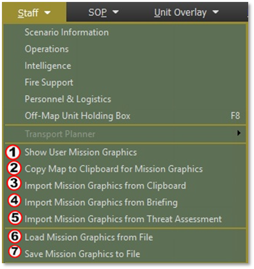
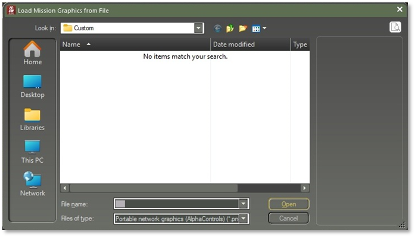
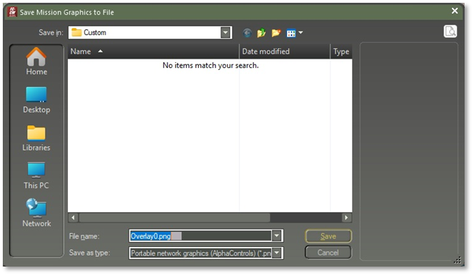

# Importing and Loading Mission Graphics

This section explains how to bring your finished mission graphics into the scenario editor or game interface. It covers the two primary options available in Flashpoint Campaigns: Cold War — “Import Mission Graphics from Briefing” and “Load Mission Graphics from File.” You will learn when to use each method, how to ensure your graphics are correctly formatted (e.g., PNG with transparency), and where they must be saved for the game to recognize them. Step-by-step instructions and best practices are provided to help you manage file naming, folder structure, and version control, thereby avoiding common import errors and streamlining your scenario setup process.

Figure 6.1: Mission Graphics Management Options

## Show User Mission Graphics

Toggles the display of the latest Mission Graphics on the map. These graphics may originate from the Briefing, Clipboard, or User-created sources. See number (1) in Figure 6.1

## Import Graphics from Clipboard

Imports mission graphics currently stored in the clipboard from an image editor. The image must match the map’s dimensions exactly. The game blends the imported image over the map, treating grey-scale pixels (including black and white) as transparent. Paint.NET is supported; MS Paint and Paint3D are not. See number (3) in Figure 6.1

## Import Graphics from Briefing

Loads a pre-configured mission graphic associated with the side's scenario briefing. See number (4) in Figure 6.1

## Import Graphics from Threat Assessment

Loads a pre-configured mission graphic tied to the scenario's threat assessment. See number (5) in Figure 6.1

## Load Graphics from File

Loads a custom mission graphic from the scenario’s Custom folder. See number (6) in Figure 6.1

Figure 4.2.2: Load Mission Graphics from File

## Save Graphics to File

Saves the currently displayed mission graphic to the Custom folder in the scenario directory. See number (7) in Figure 6.1

