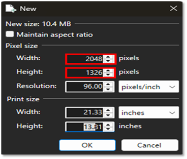
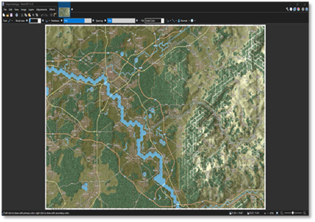
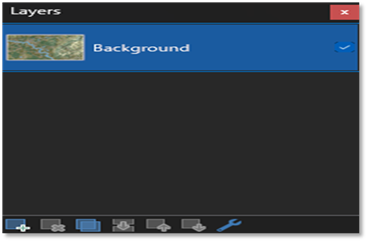
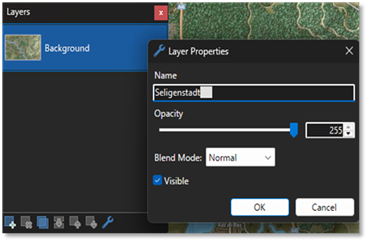
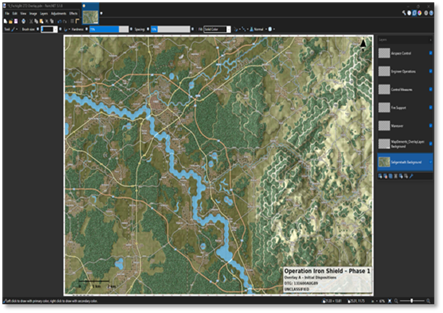

# Paint.Net Overlay Creation

Paint.NET gives you more control when creating detailed and layered military overlays. It works like a simple photo editor but lets you stack layers, use transparent backgrounds, and precisely place arrows, rings, and symbols. In this section, you’ll learn how to open your base map, add graphics on separate layers, label your units, and export a clean overlay image — perfect for use in scenarios or mission briefings.

## Creating an Overlay in Paint.NET

This guide provides a step-by-step procedure for building a professional military overlay using Paint.NET. It includes setting up the canvas, layering, adding graphics, and exporting the final transparent overlay image.

### Set Up Your Canvas

- Open Paint.NET

- Click File → New

- Set the Canvas size (e.g., 1920 x 1080 px) or match the map image, since the map I’m using is 2048 x 1326. Enter these dimensions in the width and height fields. Refer to Figure 5.1.1: Set Canvas Size

- Click Ok

Figure 5.1.1: Set Canvas Size

### Install Your Base Map (Layer 1)

- Open your map image using File → Open.

- Copy the map image, then paste it into the new canvas (Ctrl+V). Refer to Figure 5.1.2: Base Map (Color)

- To bring up the Layer window, click the Layer symbol on the far right side of the Paint.NET ribbon, or press the F7 Key. Refer to Figure 5.1.3: Open Layer

- Rename the layer by double-clicking on the layer labeled Background. Use Base Map, or the name of the map that you're using, or the name of the scenario. Click the Ok button when finished. Refer to Figure 5.1.4: Rename Layer

Figure 5.1.2: Base Map (Color)

Figure 5.1.3: Open Layer

Figure 5.14: Rename Layer:

### Add Transparent Layers for Graphics

- Click + Add New Layer

- Add multiple layers for categories such as Maneuver, Fires, Intel, C2, etc.

- Rename each layer accordingly. Refer to Figure 5.1.5: Rename Layers

Figure 5.1.5: Rename Layers

### Add Graphics (Symbols, Arrows, Circles)

- Option A – Use PNG Graphics:

o Open a transparent PNG symbol in Paint.NET.

o Copy and paste into the target layer.

o Use the Move Selected Pixels Tool to position.

- Option B – Draw Directly on Layer:

o Use the Line/Curve Tool, Ellipse Tool, or Rectangle Tool.

o Use appropriate color codes (e.g., Blue for friendly, red for enemy).

### Label the Layers and Graphics

- Use the Text Tool.

- Choose a readable font (e.g., Arial Bold, 16pt).

### Adjust Layer Order and Transparency

- Reorder layers by dragging them in the Layers Window.

- Toggle layer visibility isolates specific graphics.

- Adjust opacity if needed for blending intel and fires plans.

### Export Final Overlay with Transparency

- Hide the Base Map layer by unchecking it.

- Ensure only graphics layers are visible.

- Go to File → Save As...

- Save as PNG using appropriate naming conventions (e.g., briefingoverlatmap~side0.png).

- Ensure Auto Detect transparency is selected in the save dialog.

If you're already good at PowerPoint, you'll **adapt easily to Paint.NET****,** especially since you’re already working with transparent PNGs and layers. The main shift is thinking in **layers and pixels** instead of **shapes and slides****.**

## Creating Graphics

Creating military graphics and overlays using Paint.NET combines the strengths of both tools for maximum flexibility and precision.

PowerPoint offers an intuitive platform for quickly assembling slides, layering unit symbols, drawing movement arrows, and labeling terrain or objectives using NATO standard symbology. Its built-in alignment tools make it ideal for structured overlays. Paint.NET, on the other hand, provides more granular control over pixel-level editing, transparency effects, and layering, making it well-suited for refining maps, adjusting colors, or integrating screenshots. Together, these tools allow planners and scenario designers to build transparent, professional-quality overlays that enhance situational awareness and support mission planning.

### Creating a Graphic Using Paint.NET

This step-by-step guide demonstrates how to create a military overlay graphic entirely within Paint.NET. The example below illustrates how to make a simple Objective (OBJ) marker with a transparent background.

### Open Paint.NET and Create a New Canvas

- Launch Paint.NET

- Go to File → New

- Set canvas size (e.g., 300 x 300 pixels

- Click Ok

### Enable Layers and Set Transparency

- Go to Layers → Add New Layer

- Delete the Background layer (right-click → Delete Layer) to enable transparency

### Draw the Symbol

- Select the Ellipse Tool from the Toolbar

- Set brush width (e.g., 5px)

- Hold Shift and drag to draw a perfect circle

### Add Text (Label the Symbol)

- Select the Text Tool

- Click in the center of the circle

- Type the label (e.g., OBJ ALPHA)

- Choose font (Arial Black, Bold, ~ 16-20 pt)

- Use the Move Tool to center the text

### Optional: Add Color Fill or Effects

- Use the Paint bucket Tool to fill the circle (on a new layer below the shape)

- Add glow or shadow via Effects → Object → Drop Shadow (if installed)

### Resize the Graphic (if needed)

- Go to Image → Resize

- Check Maintain Aspect Ratio

- Resize to match your overlay scaling (e.g., 150 x 150 px)

### Save the Graphic as PNG

- Go to File → Save As

- Choose PNG (\*.png) file format

- Use a descriptive filename (e.g., obj\_alph~overlay.png)

- Ensure Auto Detect is selected to preserve transparency

This process yields a clean, transparent PNG overlay graphic, ready for use in military scenario maps or command overlays. You can repeat the same method for arrows, minefields, fire zones, and other symbols.