# PowerPoint Overlay Creation

PowerPoint makes it easy for new users to create military overlays without requiring complex design software. This section walks you through each step, from adding your map and placing arrows to using unit symbols and exporting your overlay. If you've used PowerPoint to make a presentation before, you already have the skills to create your first tactical overlay.

## How to Open and Set Up a Blank Slide

To open PowerPoint, click on the PowerPoint icon on your desktop or Start menu. Once it opens, select **“**Blank Presentation**.”**

Refer to Figure 4.1.1: Blank Presentation

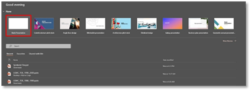

Figure 4.1.1: Blank Presentation

### Three Ways to Create a Blank Slide

By default, PowerPoint opens with a Title Slide layout, which includes text boxes like 'Click to add title.'  Refer to Figure 4.1.2: Default Slide.

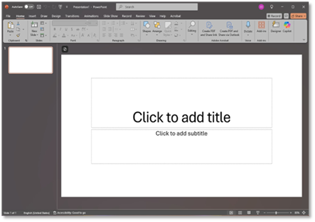

Figure 4.1.2: Default Slide

To prepare your slide for a clean military overlay, you’ll first need a blank layout. Here are three ways to do that.

#### Method 1: Right-Click Method.

- Right-click the slide thumbnail on the left panel.

- Select Layout from the menu.

- Choose Blank from the dropdown options.

- This ensures there are no placeholders, titles, or content boxes on the side. Refer to Figure 4.1.3: Right Click Method.

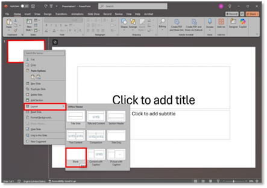

Figure 4.1.3: Right-Click Method

#### Method 2: New Slide Dropdown

- Click the New Slide dropdown on the Home Tab.

- Choose the Blank layout from the dropdown menu.

Refer to Figure 4.1.4: New Slide Dropdown

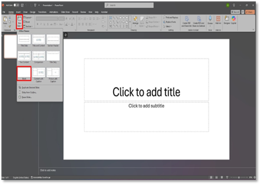

Figure 4.1.4: New Slide Dropdown

#### Method 3: Layout Button on Ribbon

- Click the New Slide dropdown on the Home Tab.

- Choose the Blank layout from the dropdown menu.

Refer to Figure 4.1.5: Layout Button on Ribbon

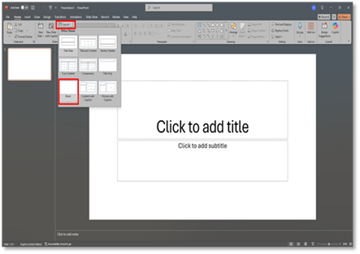

Figure 4.1.5: Layout Button on Ribbon

**NOTE:** Once the blank slide is set, your workspace will be clean and ready for overlay construction. This ensures that all map elements, unit symbols, and tactical graphics can be added without obstruction from default text boxes or slide layouts.

### Save Your Presentation (Optional)

- Press Ctrl+S or go to File → Save As.

- Save the file as a PPTX format (PowerPoint Presentation)

- Choose a name and location and then save your presentation.

Saving your presentation ensures that your current slide layout is preserved and ready for future editing. By keeping in `.pptx` format, you retain full access to PowerPoint’s editing features—essential when adding overlays, maps, screenshots, or custom graphics later. This also prevents data loss in case of accidental closure or system issues.

## Aligning Graphics to Base Map Size

When exporting overlays from PowerPoint, discrepancies between your original map image resolution (e.g., 2568 × 1952 pixels) and the exported image size (e.g., 4479 × 2638 pixels) are typically caused by PowerPoint's scaling. This scaling is influenced by several factors, including export resolution, slide size, and the method of inserting or resizing the map.

### Export Resolution Setting

PowerPoint exports images at a default resolution of 96 DPI (dots per inch), unless you manually change this setting. This impacts both the image's sharpness and its overall pixel dimensions.

Essential Factors That Affect Export Size:

- Slide dimensions (in inches or cm)

- Export method used (Save As, Export, or copy-paste)

- Office version and advanced settings (e.g., registry edits)

Example:

- A 13.33” x 7.5” widescreen slide at 96DPI exports as 1280 x 720 pixels.

- Increasing slide size or DPI results in larger, sharper images

**Note for Beginners:** If your overlay appears blurry, low-resolution DPI may be the cause.

### Map Image Stretching or Resizing

If you resize a map (e.g., 2568×1952 pixels) within PowerPoint to fit a different slide size, PowerPoint exports the resized image, not the original. This may result in distortion or blurriness.      **Best Practice:** Avoid resizing the map after inserting it into PowerPoint. Instead, size the slide to fit the map.

### Slide Size Affects Export Dimensions

To maintain overlay accuracy and image clarity:

- Navigate to the Design Tab

- Click-size → Custom Slide Size

- Adjust the width and height to match the map’s aspect ratio

- Click Ok

Refer to Figures 4.2.1: Accessing Custom Slide Size from the Design Tab and 4.2.2: *Setting Custom Slide Size to Match Map Aspect Ratio* for the slide size settings.

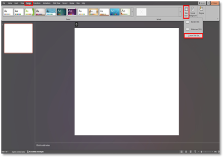

Figure 4.2.1: Accessing Custom Slide Size from the Design Tab

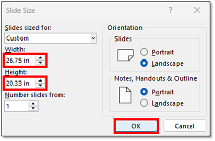

Figure. 4.2.2: Setting Custom Slide Size to Match Map Aspect Ratio

### Export with Exact Map Resolution

To avoid stretching and retain full resolution:

- Set the slide to match the map size and shape

- Insert the map without resizing

- Exports as:

o File → Save As → PNG

o Or File → Export → Change File Type → PNG or JPEG

- When prompted, select “Just This One” to export the current slide

If needed, use Paint.NET or Photoshop to make final adjustments after export.

### Match Overlay to Map Size

Follow these steps if you want your overlay to perfectly match the map’s resolution, with no blurriness or stretching:

#### Convert Map Pixels to Inches

PowerPoint uses inches to size slides. To match a 2568×1952 pixel map at 96 DPI:

- Width = 2568 ÷ 96 = 26.75 inches

- Height = 1952 ÷ 96 = 20.33 inches

#### Set PowerPoint SlideSize

- Go to the Design tab

- Click Slide Size → choose Custom Slide Size

- Enter:

o Width: 26.75 in

o Height: 20.33 in

- Click OK,

- Choose Ensure Fit.

Refer to Figure 4.2.3: Custom *Slide Size.* Refer to Figure 4.2.4: Select Ensure Fit

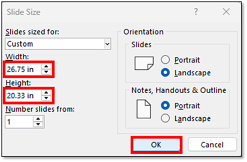   

Figure. 4.2.3:  Custom Slide Size

               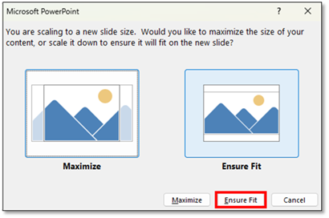Figure. 4.2.4 – Select Ensure Fit

#### Save a Reusable Template

Once you have made the Overlay to match your map, for me it was 2568x1952. I saved the PowerPoint slide, for example, Overlay\_Template\_2568x1952.pptx, so that it is already made. Of course, you will still need to perform the overlay to match your base map if the sizes differ.

## Add Your Background (Map)

Insert your base map image onto the PowerPoint slide to serve as the foundation for your overlay. This background should accurately represent the terrain, operational area, or geographical context of your scenario.

### Copy the Map

Open the “Staff” tab and select “Copy Map to Clipboard for Mission Graphics,” as shown in *Figure 4.3.1*: Copy Map to Clipboard for Mission Graphics.

Copies the current map view, including unit counters and markers, to the clipboard. This image can be pasted into an image editing program for modification. Paint.NET (Windows) is the recommended tool due to its compatibility; other programs may not support the required clipboard format.

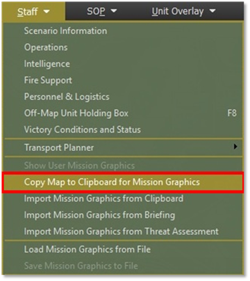

Figure 4.3.1: Copy Map to Clipboard for Mission Graphics

### Paste and Save the Map

Paste the copied map into an image editing program such as Paint, Paint.NET, GIMP, or any similar software you prefer.

Save the image as a JPEG file in a location you can easily find later.

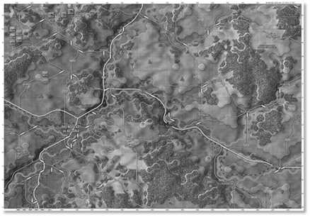

Figure 4.3.2: Base Map (Grayscale)

This should replicate the grayscale image, as shown in Figure 4.3.2: Base Map (Grayscale), with unit markers positioned on the map to indicate their locations. This setup allows for easy addition of graphical elements. Repeat this process for both Blue and Red forces.

If the grayscale base map is difficult to read, you can capture a color screenshot instead. Once you've completed the scenario and placed all required units and elements, and you're ready to create an overlay, this method provides a more explicit reference.

First, go to New Scenarios and select the scenario you have built. Select Game → Full Map Screen Capture as shown in Figure 4.3.3: Full Map Screen Capture

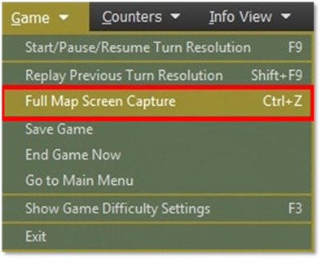

Figure 4.3.3: Full Map Screen Capture

Once you have selected the “Full Map Screen Capture” option, a screen will appear showing where to save the screen capture. Refer to Figure 4.3.4: Location of Save Screen

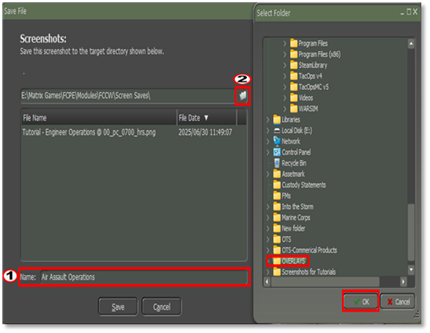

Figure 4.3.4: Location of the Save Screen

Assign a name to the Base Map and choose a location to save the screen capture. You may also rename the file and click “Save” to store it in the scenario’s default folder. For better organization, it’s recommended to create a dedicated folder named “Overlays” to ensure you can easily find it later. See number (1) in Figure 4.3.4. If you wish to save it elsewhere, click the button, see number (2) in Figure 4.3.4  to open a window with additional location options. Select your “Overlays” folder and click OK. Once the save location is confirmed, a new window will appear, displaying the selected path. Click “Save” to complete the process, as shown in Figure 4.3.5: Final Location of Saved Screen Capture.

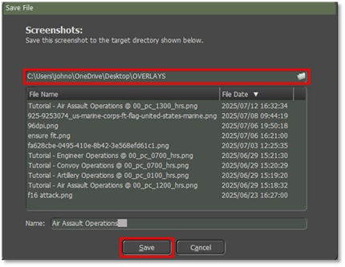

Figure 4.3.5: Final Location of Saved Screen Capture

As shown in Figure 4.3.6: Base Map (Color), this is how the base map will appear when saved in color, providing improved clarity compared to the grayscale version.

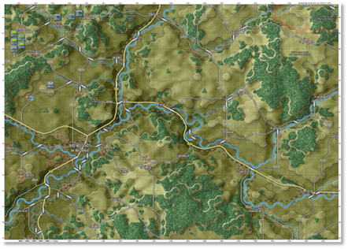

Figure 4.3.6: Base Map (Color)

### Insert the Base Map into the Slide

Insert the saved map image onto your PowerPoint slide. Align it to fully cover the slide canvas, ensuring the dimensions match the slide size exactly. This forms the visual foundation for overlaying tactical graphics.

#### Open YourPowerPoint Presentation

- Launch PowerPoint and open the presentation where your map overlay will be created. Navigate to the slide designated for the base map.

#### Insert the Base Map Image

- Click on the “Insert” tab in the top menu. Select Pictures → This Device.

- · Browse to the location where you saved your base map image (e.g., the "Overlays" folder). Select the image and click “Insert.“ As shown in Figure 4.3.7: Insert Base Map

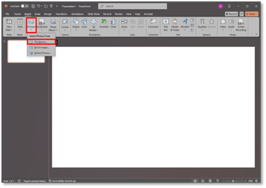

Figure 4.3.7: Insert Base Map

#### Image Fit to the Slide Automatically

- Since the slide has already been sized to match the dimensions of the base map, the image should fit perfectly upon insertion. There is no need to resize or align the image manually. As shown in Figure 4.3.8: Fit the Image to the Slide Automatically

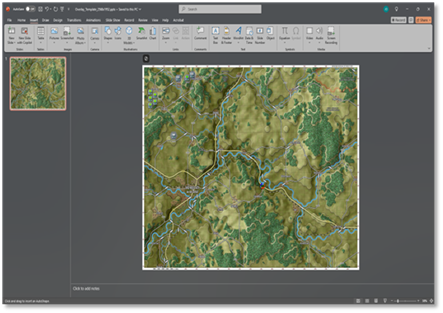

Figure 4.3.8: Fit the Image to the Slide Automatically

#### Lock the Base Map (Optional)

- To prevent accidental movement, right-click the image and select “Send to Back.” Then, consider grouping the image with any background elements or using PowerPoint’s “Selection Pane” to lock it in place.

#### Save Your Progress

- Press Ctrl + S or go to File → Save to ensure your updated slide with the base map is stored correctly.

## Add a Transparent Slide

Insert a new blank slide and make the background fully transparent to prepare for overlay graphics.

This transparent layer enables you to build and export military symbols without including the underlying map, ensuring clean overlays for reuse or printing.

**Note:** This section offers two methods for creating transparent slides—using a single slide for all graphics or creating multiple slides for each type (e.g., Maneuver, Fires, Engineers). The**preferred method is to use a single transparent slide** to keep the overlay process streamlined and easier to manage.

### Method 1: Transparent Slide Rectangle

The first method for creating a transparent slide is with a transparent rectangle.

- Navigate to Insert → Shapes → Rectangle and Refer to Figure 4.4.1: Insert Transparent Rectangle.

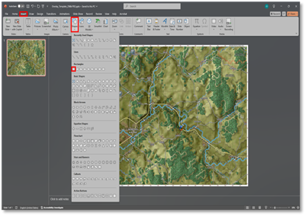

Figure 4.4.1: Insert Transparent Rectangle

- Click and drag from the top-left corner of the base map to the bottom-right corner, covering the entire map area. Refer to Figure 4.4.2: Click and Drag

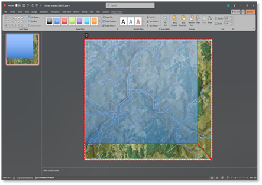

Figure 4.4.2: Click and Drag

- With the rectangle selected, go to the Shape Format tab. Refer to Figure 4.4.3: Shape Format Tab

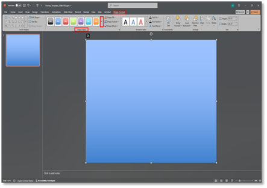

Figure 4.4.3: Shape Format Tab

- Open the “Shape Styles” dropdown and choose one of the “Preset Transparent options. Refer to Figure 4.4.4: Preset Transparent

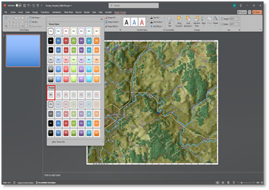

Figure 4.4.4: Preset Transparent

- This makes the shape visually invisible while still masking the base map underneath.

### Method 2: Using Transparent Layers

This method uses transparent shapes to create a clear overlay layer above the base map. By stacking and organizing each layer (e.g., Maneuver, Fires, Engineers), you can manage and export individual overlays while maintaining alignment with the underlying terrain.

#### Duplicate the Slide for Each Overlay Type

Right-click the Slide 1 thumbnail in the left pane and select 'Duplicate Slide'.

Do this multiple times to create a slide for each overlay type (e.g., Maneuver, Intel, Fires, Engineers). Refer to Figure 4.4.5: Select Duplicate Slide.

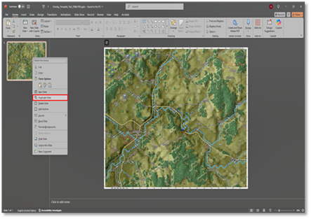

Figure 4.4.5: Select Duplicate Slide

#### Rename Each Slide

Once you have duplicated your transparent slide for each type of overlay (see Section 2.4.2.1), it is essential to rename each slide accordingly. This step will help you stay organized, especially when managing multiple overlays such as Maneuver, Fires, Engineers, and Intel.

Renaming slides ensures that you can quickly identify and switch between overlays without confusion. PowerPoint may label duplicated slides generically, such as 'Slide 3 (Copy)', which can be challenging to track later.

Follow these steps to rename each slide:

- Navigate to the slide thumbnail panel on the left-hand side (Normal View) or open Slide Sorter View (View → Slide Sorter).

- Right-click on the slide you wish to rename.

- Choose 'Rename Slide' (or, if unavailable, insert a text label on the slide identifying its overlay type).

- Enter a descriptive name, such as:      - 01\_Maneuver Overlay      - 02\_Fires Overlay      - 03\_Engineer Overlay      - 04\_Intel Overlay

Using numbered prefixes can help keep the slides in logical order. This naming method becomes especially useful when exporting each overlay image separately.

Refer to Figures 4.4.6: Rename Each Slide and Figure 4.4.7: Insert Text Box

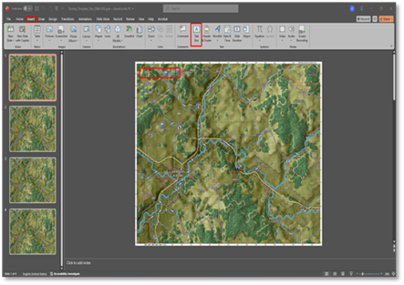

Figure 4.4.6: Rename Each Slide

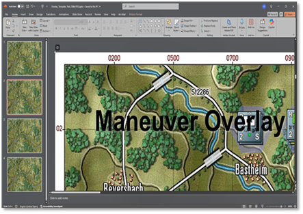

Figure 4.4.7: Insert Text Box

## Create your Graphics

In this step, you will create standardized military symbols directly on your transparent slide to visually communicate unit positions, tactical missions, and control measures. These graphics are essential for ensuring clarity and consistency when briefing or presenting operational plans.

### Types of Graphics:

For a detailed list of military overlay graphics, see Appendix A4.

- Tactical Mission Graphics     Represent operational tasks such as attack routes, defensive lines, support-by-fire positions, and objectives. These graphics help communicate the intent and sequence of maneuvers.

- Graphic Control Measures (GCMs)     Include boundaries, phase lines, checkpoints, and coordination points. GCMs regulate movement, fires, and command/control, ensuring all units act in sync.

- Unit Symbols     Depict military formations and installations. Each symbol conveys unit size, type, and roles such as infantry, armor, or artillery—and helps identify friendly, enemy, or neutral forces.

### Adding Graphics to the Slide

In this step, you will begin placing your military symbols, tactical graphics, and control measures onto the transparent slide. Use the PowerPoint “Insert” tools to add shapes, lines, and icons, positioning each element precisely over your base map to represent unit locations and mission details.

#### Inserting a Graphic Symbol

Go to the Insert tab. Click on Pictures, then select This Device. Browse your folder containing military graphic symbols. Refer to Figure 4.5.1: Insert a Graphic Symbol. Select a symbol and click Insert. Refer to Figure 4.5.2: Graphic Insert on Overlay.

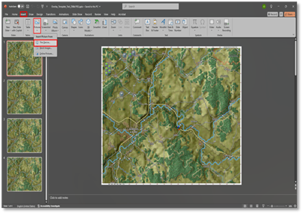

Figure 4.5.1: Insert a Graphic Symbol

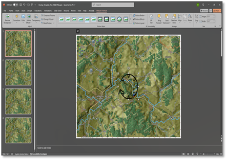

Figure 4.5.2: Graphic insert on Overlay

#### Positioning and Resizing the Graphic

Drag the inserted symbol to the correct location on the slide (e.g., the enemy's position, the friendly route). Use the arrow keys for fine-tuned placement. Click and drag a corner of the symbol to resize it proportionally. Hold Shift while dragging to maintain aspect ratio (optional for accuracy).

#### Aligning and Layering Graphics

Right-click the graphic → Bring to Front or Send to Back as needed to layer symbols correctly. Use the Align tools in the Picture Format tab for precise alignment.

#### Adding Text Labels (Optional)

Click Insert → Text Box, then type a label (e.g., '1-502 IN', 'PL RED', 'OBJ FALCON'). Position the label next to its graphic and format it using the Home tab (font size, bold, color).

#### Grouping Elements (Optional)

Select a symbol and its label while holding Shift→ Right-click and choose Group → Group. This keeps the label and icon together when moving.

#### Repeating for All Graphics

Continue adding mission graphics, GCMs, and unit symbols as needed to complete your overlay.

#### Saving Your Progress

Press Ctrl+S to save your presentation with all inserted graphics. Refer to Figure 4.5.3: Save File

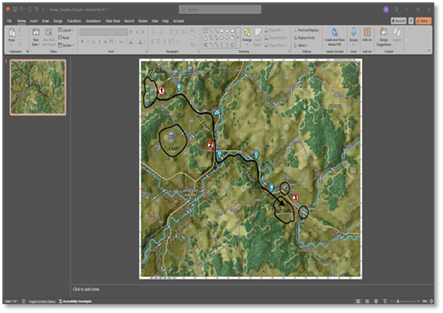

Figure 4.5.3: Save File

**Note:** If you cannot find the specific symbol you need or want to create a custom unit symbol, refer to Appendix A5 – Guide to Searching Unit Symbols on Symbol.Army for detailed instructions on building your symbol.

## Create a Transparent Overlay Image

The following Screenshots will show you how to make a PowerPoint slide transparent by exporting your graphic elements as a transparent PNG overlay.

### Remove Base Map Slide:

To remove the background image (base map), click and hold the left mouse button on the map, then drag it to the right to align as shown in Figure 4.6.1: Remove Base Map Slide. Next, right-click and select "Cut" to remove the map, as shown in Figure 4.6.2: Delete/Cut Base Map. Alternatively, press the delete button on your keyboard, and the map will appear as shown in Figure 4.6.3: Base Map Removed.

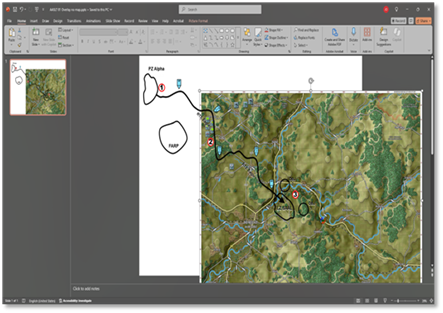

Figure 4.6.1: Remove Base Map Slide

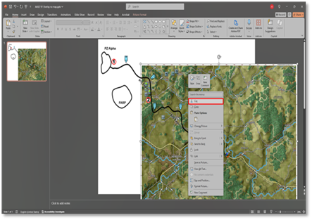

Figure 4.6.2: Delete/Cut Base Map Slide

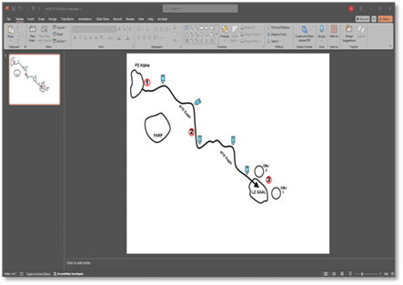

Figure 4.6.3: Base Map Removed

### Select All Graphic Elements:

Press Ctrl + A to select all elements on the slide. Refer to Figure 4.6.4: Select All Graphics

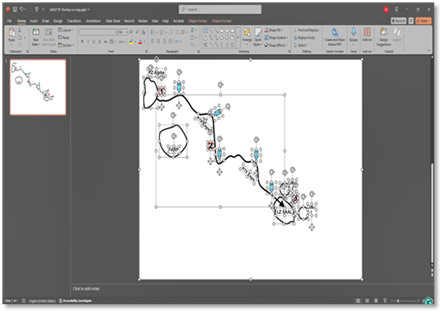

Figure 4.6.4: Select All Graphics

### Save as Picture:

Right-click on the grouped object, then select "Save as Picture." Refer to Figure 4.6.5: Save as Picture

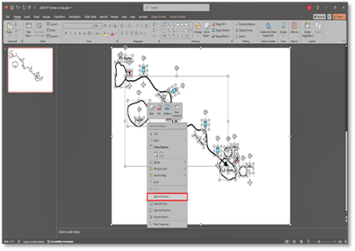

Figure 4.6.5: Save as Picture

### Save with Transparency:

 Save the File Type as a PNG, the File Name as: briefingoverlaymap~side0.png, then click Save. Refer to Figure 4.6.6: Save with Transparency.

Refer to Section 4.6.5 Mandatory File Naming Convention to name your file correctly.

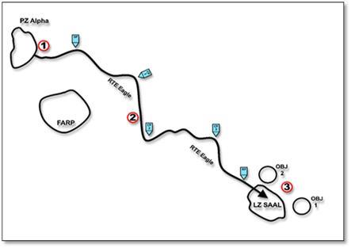

Figure 4.6.6: Save with Transparency

**Note:** Although the screenshot does not visually show the transparency, it *is* present. Transparent areas often appear as solid white or may blend into the background in static images. Still, when exported or used in your overlay, those areas will remain see-through as intended.

Place the file in your preferred location, within the folder for the scenario you're creating.

### Mandatory File Naming Convention:

For effective organization and clarity, use the following naming conventions for overlay files.

- Briefing Overlay:

o Player 1 (NATO): briefingoverlaymap~side0.png

o Player 2: (Warsaw Pact) briefingoverlaymap~side1.png

- Threat Assessment Overlay:

o Player 1 (NATO): threatoverlaymap~side0.png

o Player 2 (Warsaw Pact): threatoverlaymap~side1.png