# Altering an Existing Scenario

Altering an existing scenario generally refers to making changes or modifications to a pre-existing situation or set of circumstances.

How to load an existing scenario and then step through and edit it.  Also, cover the Data Update and Excel import/export functions for adjustments.

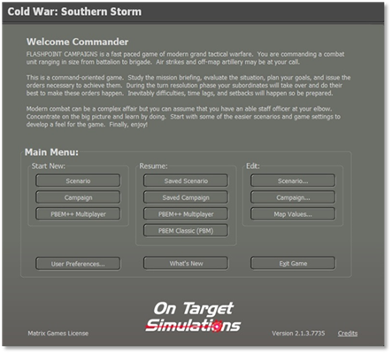

Figure 138

**NOTE:** If you are going to make changes to existing scenarios change the name and refer to it in the “Scenario Details and Notes”.

At the Main Menu\Edit select the “**Scenario**” button as shown in Figure 138 to bring up the “Scenario Creation Checklist” as shown in Figure 139 and select the “**Load** **Standalone Scenario File**” button as shown in Figure 139. That in turn will bring up “Select and Load Standalone Scenario File”. Here you will select the scenario that you want to make changes to.

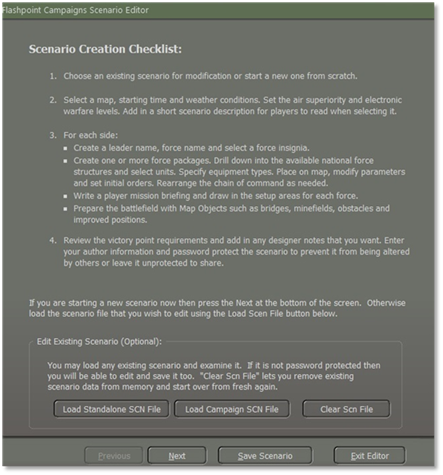

Figure 139

For this example, we will select the West German scenario “Lessons of War” and then select the “**Proceed**” button as shown in Figure 140.

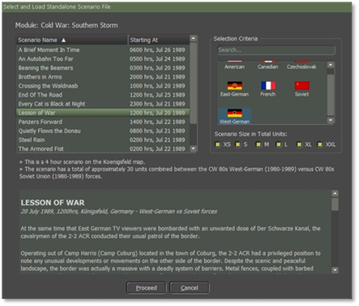

Figure 140

After the scenario is loaded and before selecting the “**Next**” button, you should save the scenario file with a new name by selecting the “**Save** **Scenario**” button as shown in Figure 141.

For this example, I will name the new scenario “Kriegspiel” and then select the “**Proceed**” button as shown in Figure 141.

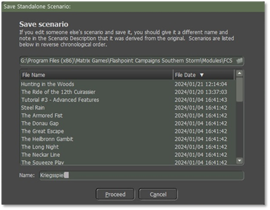

Figure 141

Once you select the “proceed” button you will get a confirm popup screen then click on the “**OK**” button as shown in Figure 142 to take you back to the scenario to start making your changes.

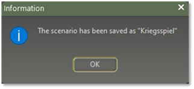

Figure 142

You can make changes to the scenario as you did when making a new scenario as shown in “Section 4 Creating a New Scenario”. The last screen that you will see when you finish making the changes is the “Scenario Details and Notes” as covered in “Section 4.13 Scenarios Details and Validation” in the Notes box need to give credit to the original scenario.

## Editing Scenario using XLS

Sometimes when working on a scenario it can be a pain, for example, when you want to replace one type of equipment with another. The XLS Export/Import function was developed to help with this.

For example, in a scenario, there were nine M109G and we will reduce the number of SPArty subunits in a West German Artillery Battery from nine to six.

Load the scenario into the Scenario Editor and pull down the Scenario Editor>Export Game Data to .xlsx file menu item as shown in Figure 143. 

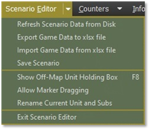

Figure 143

Read the warnings and limitations then select the “**Proceed**” button as shown in Figure 144.

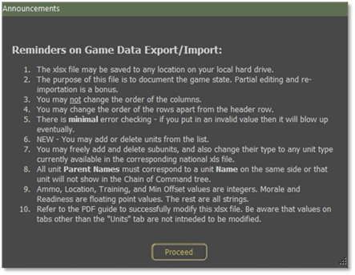

Figure 144

Save the file to disk. By default, the file name is based on the scenario name, and it will be placed into the \Modules\FCSS\Scenarios\ folder as shown in Figure 145.

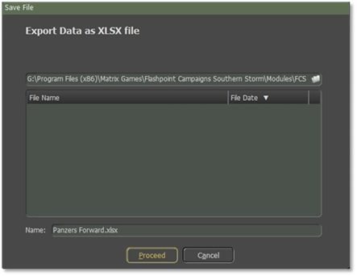

Figure 145

Open the XLSX file in Excel or an equally capable program. Select the “**Units**” Tab as shown in Figure 146. You can look at the other tabs, but changing entries in them may wreck your game when you import the file back into the scenario.

 

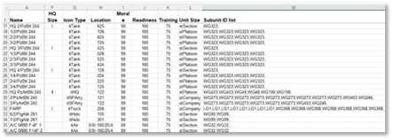

Figure 146

Each unit is a row in the spreadsheet and each column is an item of data for that unit. You want to look at column “M” “Subunit ID List” as illustrated in Figure 146. You will also need to look at column “U” to see what the National Data Filename is. You will need to know which data file to reference for a given unit to make the changes to validate them all in this example it will be CW 80s West-German xls which will be located at \Modules\Common\Data\Nation, once open, go to the “Units” tab, column “A” for the SUTag values that you will need to add/replace in column “M” of the .xlsx file for that scenario you’re working on. In this example, you will be looking for WG273. “Section 7 Updating Scenario Data” will go into more detail.

You want to look up and find the unit you want to change by its name from column “A”. In this case, it is 2/PzArtBtl 245is the artillery unit we want to edit as shown in Figure 147.

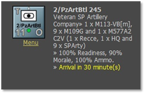

Figure 147

The subunit ID corresponds to the codes contained in the relevant national data .xls file for that unit. In this example, we see “WG273” repeated nine times. These are the nine SPArty subunits that we want to change.

Edit this cell to remove three of the “WG273” entries. A comma must remain between all subunits in the list. There must be a trailing comma at the end of the list for it to be parsed correctly. Spaces for readability are optional.

In this example, we were just removing three subunits. If needed we could change the model of the M109 used, we could do an Excel Search and Replace to change instances of WG273 to something else instead. We could also add new subunits to this or any other unit.

When you’re done editing your scenario spreadsheet then save the xlsx file to disk.

Now we will Import the file back into the scenario by selecting the Scenario Editor\Import Game Data from the xlsx file to reload the scenario data as shown in Figure 143.

You will get a popup screen stating a reminder of caution and then select the “**Proceed**” button as shown in Figure 148.

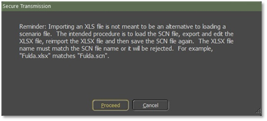

Figure 148

A screen “Import Data from XLSX file” will displayed and you must highlight the scenario name, for this example, we will highlight the Panzer Forward xlsx file and then select the **Proceed**” button as shown in Figure 149.

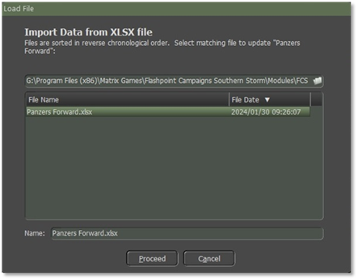

Figure 149

The correct scenario must already be loaded into the “Scenario Editor” for this to work. The file will be imported and parsed, and the scenario editor will be updated or may crash if the data is wrong. You can now browse the unit and check that your edit had the desired effect. Save the scenario in the normal way or your changes will be lost.