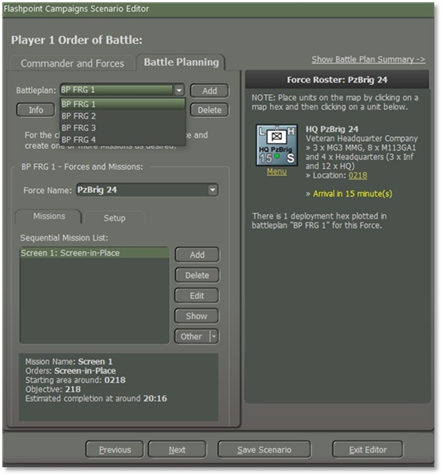
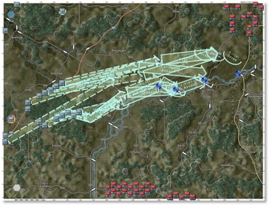

# Battle Plans

We are going to show what Battle Plans can do to make scenarios or campaigns have more replayability options to a scenario. **FM05:** **Battle Planning** will have more details on how to make them.

Figure 136

Additional Battleplans can be added to scenarios to increase the replayability of any given scenario further.

SOP adds a section and notes that the designer should set reasonable SOPs for units in each battle plan. The best way would be to use the menu and select by unit type and mission which will be covered in **FM05:** **Battle Planning.**

Figure 137