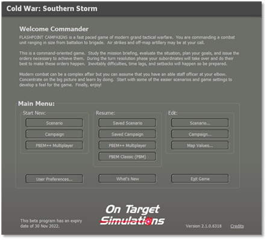
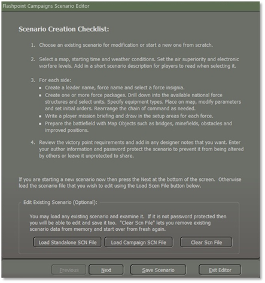

# Getting Started

Welcome to making content for the game system. The Scenario Editor, or ScenEdit for short, is a tool to make your scenarios with the supplied data and maps in the game.

Videos were made by On Target Simulations LTD making Scenarios and are posted at this link:[How to Create a Scenarios](https://www.youtube.com/watch?v=iULAXVVscbY)

To get started, select the “**Scenario**” button in the Edit section of the Main Menu, as illustrated in Figure 1.

Figure 1

Clicking the “**Scenario**” button will launch the Scenario Editor. It may take a few minutes for the editor to load up and show you a map (the first map in the list by name, you can change it later to the one you want to use), mini-map, menu bar, and the main Scenario Editor Dialog, as illustrated on Figure 2. We will use these tools to make a small scenario.

Figure 2

## Scenario Creation Checklist

It would help if you took a minute and read through the Scenario Creation Checklist on the starting page of the dialog for some critical information on using the editor.

## Edit Existing Scenario (Optional)

There are a few options here to edit existing scenario files via the different buttons, and they are as follows:

- **Load Standalone SCN File** – This option will open the Scenario Listing for the current module (Southern Storm for now). The same filters and selection options from playing a game are here. You can select a scenario to edit with your changes and then save it with a new or altered name or open a new scenario you're working on to alter or complete it.

- **Load Campaign SCN File** – This option will open the Campaign Scenario Listing for the current module (Southern Storm). The same filters and selection options from playing a game are here. You can then select a scenario to edit with your changes and save it with a new or altered name or open a new scenario you are working on to alter or complete it.

- **Clear Scn File** – This button will wipe all the data for the currently selected scenario from the game so you can start fresh. 

!!! note

    There is no undo from this, so be sure you want to dump everything.

If you plan on editing an existing scenario, that information is covered in Section 6 below.

## Scenario Editor Dialog Buttons

At the bottom of the main Scenario Editor dialog are four buttons that stay in place as the pages change. These buttons have the following functions.

- **Previous** – Return to the previous page in the Scenario Editor dialog.

- **Next** – Move to the next page of the Scenario Editor dialog.

- **Save Scenario** – Opens up the Scenario Save dialog box where you can give the scenario a name or save over your existing scenario build/design. If you are changing an existing scenario (someone else's work), please make a name adjustment or rename to avoid confusion or overwriting game content.

- **Exit Editor** – This button exits the Scenario Editor ***WITHOUT*** saving any information or changes.

Since starting a new scenario, we must select the “**Next**” button and read Section 4 below.