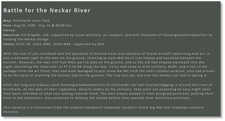
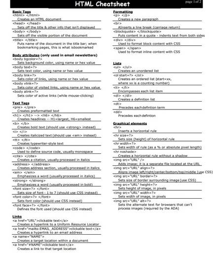
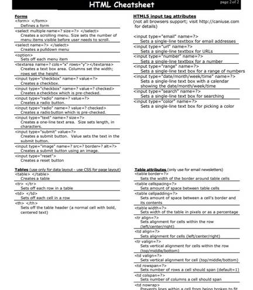
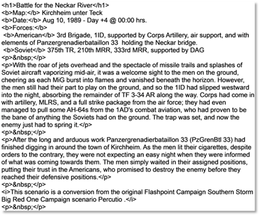

# HTML Quick Reference

 Here is an example of my Scenario Briefing that I made for a scenario as shown in Figure 153.

Figure 153

Looking at Figure 154 and Figure 155 show the HTML codes that I used to make the Scenario Briefing.

Some of the codes will work, some won't. You must do a trial and error to get the right code needed.

Figure 154

Figure 155

Figure 156 shows the code that was typed in the “Create Scenario Description, Plain Text Editor and the results shown in the HTML Text Preview as shown in Figure 153.

Figure 156