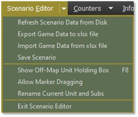

# The Top Menu

The Top Menu for the Scenario Editor is nearly the same as the in-game menu except for the first entry, which is now called “Scenario Editor” as seen in Figure 3.

Figure 3

- **Refresh Scenario Data from Disk** – Use this menu item to update all the unit data in the scenario if the game data is updated. See Section 7 below for details on how to use this function. It would help if you had a scenario loaded to activate.

- **Export Game Data to XLSX File** – Use this menu item to export scenario data to a tabbed Excel spreadsheet where you can edit certain information. It must have a scenario loaded to activate. See Section 6 below.

- **Import Game Data from XLSX File** – Use this menu item to load data for a scenario from a selected Excel spreadsheet that has been edited. See Section 6 below for details on how to use this function. It must have a scenario loaded to activate.

- **Save Scenario** – Opens the Save Scenario dialog. Scenarios can be saved in an incomplete state so you can come back and finish them later.

- **Show Off-Map Unit Holding Box** – This opens the Off-Map Holding box to show what units are in the game but located off-map. You can edit the parameters of those units from this dialog.

- **Allow Marker Dragging** – Checking allows you to click on and drag map markers to new locations. Unchecking this will lock the markers in place and make sure you don’t accidentally move a marker when working with units and plans.

- **Rename Current Unit and Subs** – If a unit is selected on the map or from the off-map holding box, you can use this function to rename the units in the dialog box that pops up.

- **Exit Scenario Editor** – Exits the Scenario Editor and sends you back to the Main Menu.