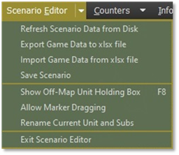
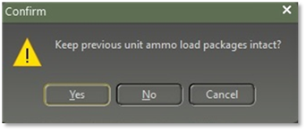
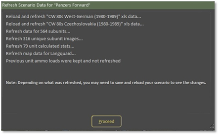

# Updating Scenario Data

Just to reiterate you can only do a Refresh in Scenario Editor mode not during the actual turn. To update a scenario data, go to the Scenario Editor and select “Refresh Scenario Data from Disk” as shown in Figure 150.

!!! note

    You only need to do this if “**your**” scenario needs to be updated with a new National Era Data. If there is new data, it will be automatically updated to the scenarios that came with the game.

Figure 150

Once you click on the “Refresh Scenario Data from Disk” a popup screen will state “Keep previous unit ammo load packages intact?” If you click the “**Yes**” button you will keep the ammo load as is, if you click the “**No**”   button it will revert to the default load. If you click on the “**Cancel**” button it will not proceed and will cancel the refresh scenario data. We will click on the “**Yes**” button as shown in Figure 151.

Figure 151

Figure 152

After you select the “**Yes**” button a popup screen will appear loading the new data. For this example, we refresh with the scenario “Panzer Forward” as shown in Figure 152, and then select the “**Proceed**” button.

!!! note

    depending on what was refreshed, you may need to save and reload your scenario to see the changes.